# 실습 튜토리얼 요약 

#### 2016116563 윤성한

# 1. Markdown

### 1.1 마크다운이란?

```
마크다운은 텍스트기반의 마크업 언어로 2004년 존 그루버에 의해 만들어졌으며 쉽게 쓰고 읽을 수 있고 HTML로 변환이 가능하다.특수기호와 문자를 이용한 매우 간단한 구조의 문법을 사용하여 웹에서도 보다 빠르게 컨텐츠를 작성하고 보다 직관적으로 인식할 수 있다. 
```

###  1.2  마크다운의 장단점 및 속성

```
장점으로는 간결하고 별도의 도구없이 작성가능하며 다양한 형태로 변환이 가능하다.
단점으로는 표준이 없어 도구에 따라서 변환방식이나 생성물이 다르다는점이 있다
필자는 Typora라는 마크다운 에디터를사용하고 있으며 확장자명은 .md로 나타난다. 
```

참조 링크: <https://gist.github.com/ihoneymon/652be052a0727ad59601>

# 2. Vi

### 2.1 Vi란?

* Vi 실행화면 (vim이라고도 함)

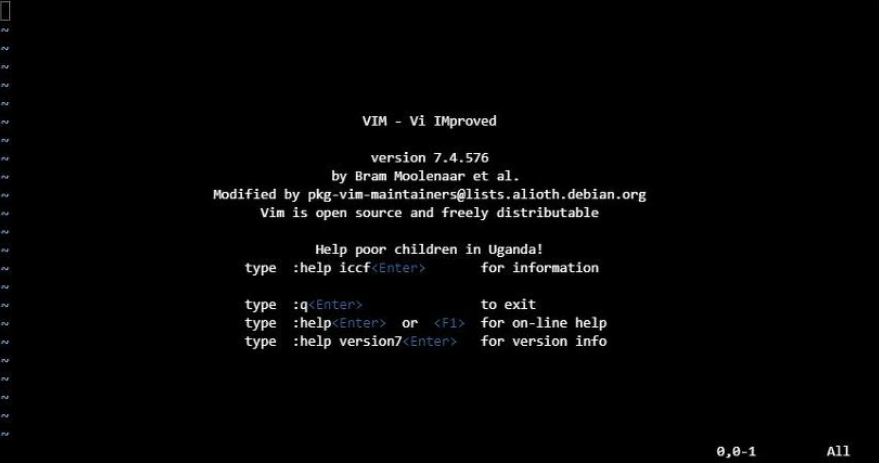

```
리눅스에서 가장 많이 사용하는 텍스트 에디터(정확히 말하면 vim)이며
아래 그림처럼 명령모드와 입력모드 마지막행 모드 총 세 가지가 존재합니다.
처음 vi 에디터를 실행하면 명령모드로 시작을 합니다. vi 에디터 명령모드에서는 커서이동, 복사, 붙여넣기, 문자열 검색 등을 수행할 수 있습니다.
```

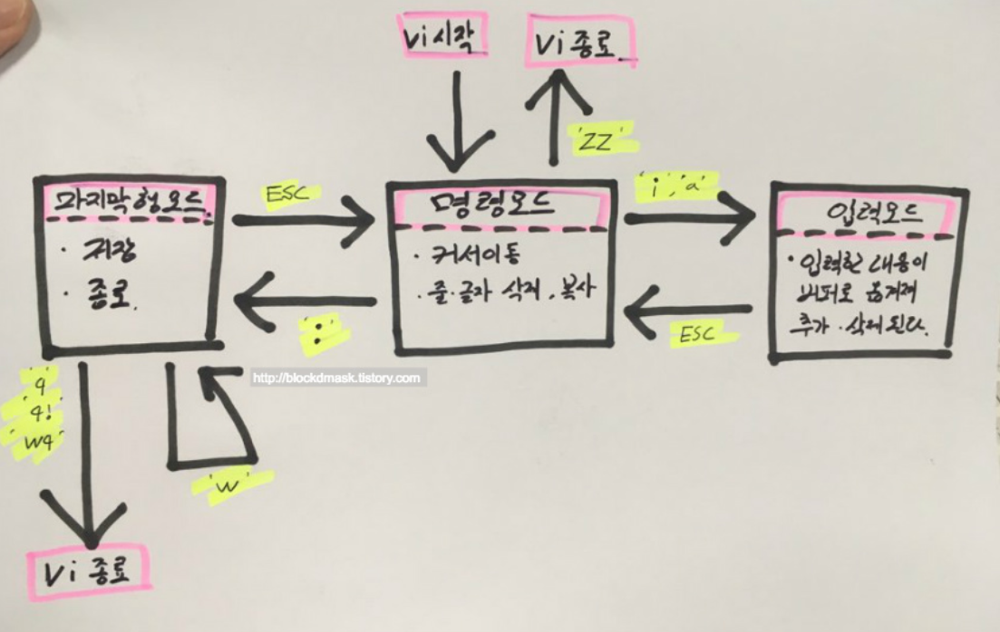

### 2.2  Vi의 기본적인 사용법

```
첫번째로 명령 모드에서의 명령어들이며 esc눌렀을 때 또는 vi 들어가자마자 나오는 상태 입니다. 엔터를 치지않아도 명령이 바로 실행 되는 특징이있습니다.
```

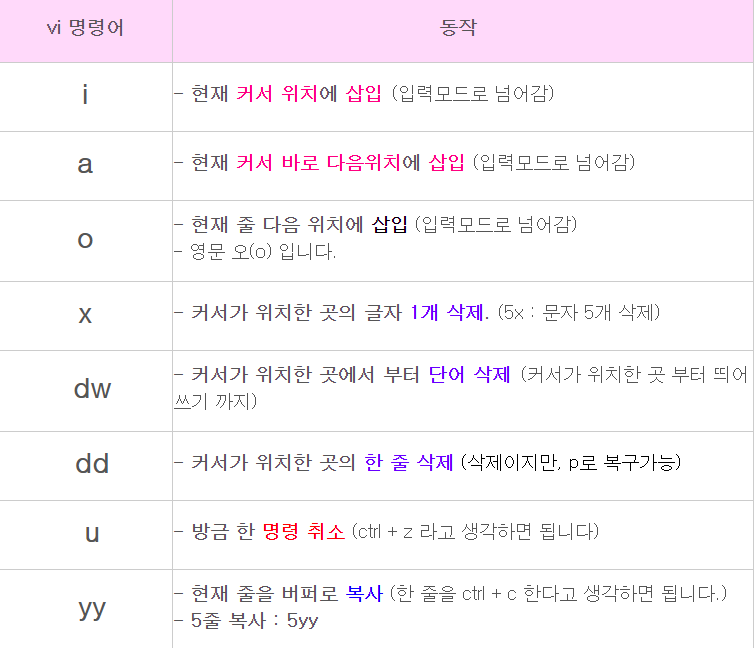

```
다음으로는 마지막 행 모드에서의 명령어들이며 esc 누르고, 콜론을 누르면 나오는 상태입니다. 아래 명령어 하고 엔터를 쳐야지 명령이 들어갑니다.
```

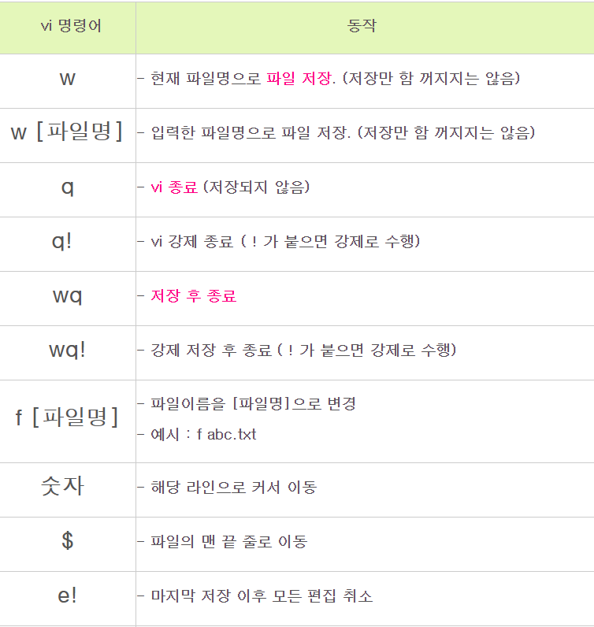

```
추가적으로   
:sp  -  화면 분할    
ctrl w w를 사용하면 분할된 화면을 이동가능   
:e [파일이름] - 에디터로 기존파일 열기
현재 디렉토리에서 해당 파일 첫글자를 치고 tab을 누르면 바로 fullname화 가능    
등이있다.
```


# 3. Makefile

### 3.1 Makefile 사용법 요약

* 아래의 세 개의 소스파일로 makefile의 빌드 절차를 간단히 설명 하자면
* 세 개의 소스파일을 각각 컴파일하여 Object파일(*.o)을 생성하고
* 이들을 한 데 묶는 링크 과정을 통해서 실행 파일인 a.out을 생성한다. 
* 여기서 소스파일에 정의된 함수를 main에서 호출하는 **의존성**이 존재한다.

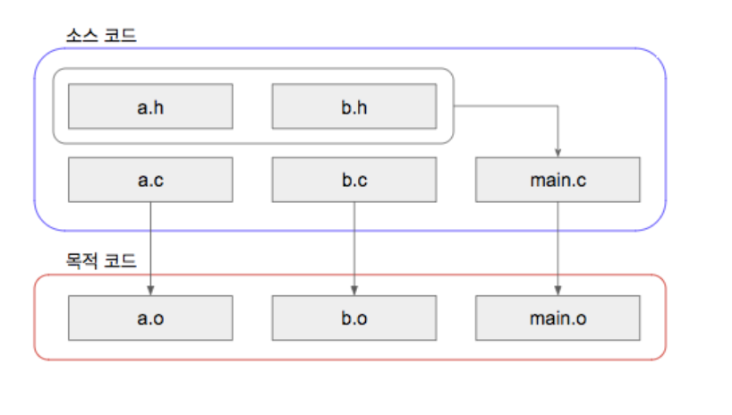

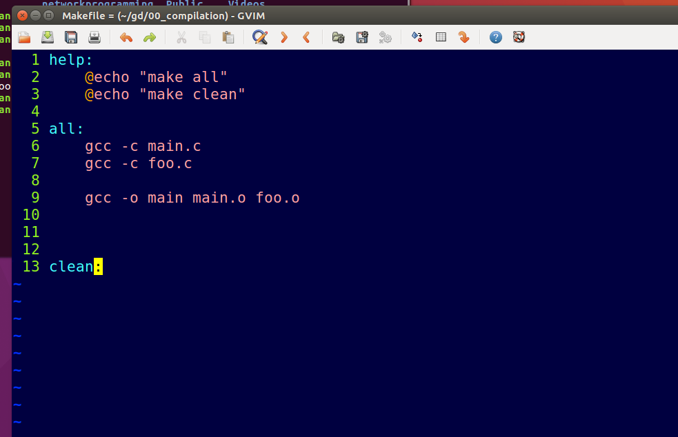

```
수업시간에 진행한 예시로 한번 더 요약을 해보자면
다음 사진은 Makefile의 코드 내부이며 터미널에서 make all을 입력하면 
main.c와 foo.c를 동시에 컴파일하고 나온 main.o 와 foo.o를 각각 링킹하여 최종적으로 실행파일 main을 생성한다. 
```

# 4. gcc

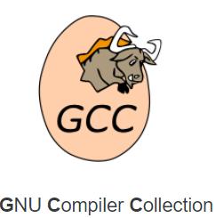

### 4.1 gcc 명칭 및 설치 방법

```
gcc는 한마디로 리눅스용으로 사용되는 대표적인 c컴파일러라고 생각하면 된다.
gcc를 사용하는 방법은   
1. 일단 ubuntu에서 gcc가 설치 되어있는지 확인을 한다 아래와 같은 메세지가 나오면 설치가 되어있다
```

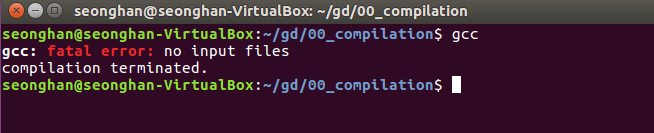

```
2. 설치된 gcc 버전을 확인하기 위해서는 gcc--version 이라고 입력하면 된다.
```

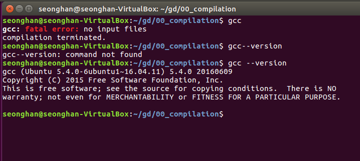

```
3. 만약 gcc가 설치가 되어있지않으면 sudo apt-get install gcc라고 입력하면 설치가 진행된다 기본적으로 gcc는 vi와 거의 같이 사용 되므로 리눅스 개발환경에 필수적이라고 할 수 있다.
```

# 5. C header

### 5.1 헤더파일이란?

```
c언어에서는 헤더파일이 존재하며 일종의 메뉴판이라고 생각하면 된다
메뉴판만 있다면 다른 부가적인 설명없이 원하는 메뉴를 골라서 소비자가 사용할 수 있는것 처럼 c언어상에서도 헤더파일을 사용하면 헤더파일안에 있는 여러가지 정의되어있는 함수들을 편리하게 사용할 수 있는것이다.
```

### 5.2 사용 예시

```
자신만의 자료구조 라이브러리를 만들 때 헤더파일을 이용하여 자료구조 함수들을 main에서 언제든지 사용할 수 있다. 
즉 코드 재사용성과 가독성이 향상 된다.
다음은 리눅스 상에서 본인이 작성한 자료구조 헤더파일이다.
```

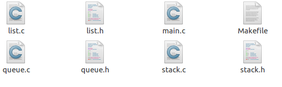

``` 
각각의 헤더파일에는 각 함수의 프로토 타입만 정의 해놓았으며 c파일에는 함수의 내용이 작성 되어있다.
최종적으로 main.c에서 사용할 라이브러리 헤더를 사용하여 언제든지 헤더파일의 함수를 사용할 수 있게 한다. 이 내용은 위의 makefile에서도 사용된 부분이며 makefile을 사용하여 헤더파일과 c파일 컴파일 및 링킹을 쉽고 편하게 사용할 수 있다.
```

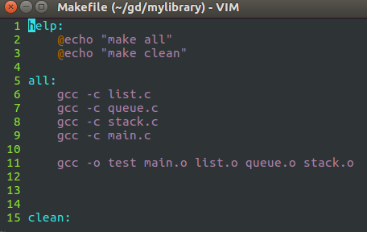

* 최종적으로 각각의 헤더파일 및 C파일을 컴파일 및 링킹 하여 생성된 실행파일 test를 실행 한 모습 (main.c에서 라이브러리를 사용할 수 있게 된 상태)

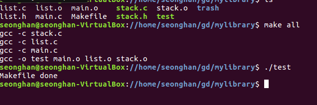

---

reference : <https://blockdmask.tistory.com/2>

<https://programfrall.tistory.com/20>

<https://gist.github.com/ihoneymon/652be052a0727ad59601#file-how-to-write-by-markdown-md>


