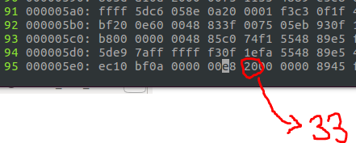
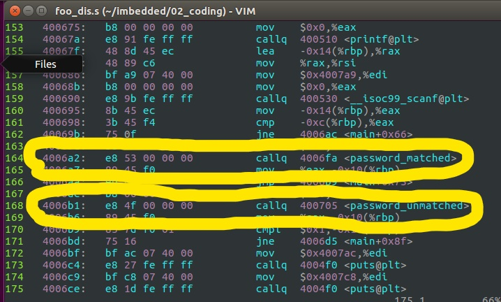

# 2강 요약 정리 및 과제

#### 2016116563 윤성한

# 1. Summary

```
핵심적으로는 c파일을 건드리지않고 binary코드를 건드려서 원하는 결과를 도출할 수 있게 한내용을 요약하였습니다.
```

### 1.1 makefile dependency 을 이용한 conditional compilation 와 object manual linking

```
makefile에서 사용되는 규칙을 우선 요약 정리하면
target ... : dependencies ...
        command
의 구조로 표현이 됩니다.
target은 일반적으로 프로그램에 의해서 생성되는 파일
dependency는 target을 만들기 위한 입력으로 사용되는 파일
command는 make가 실행하는 액션입니다.

아래 사진과 같은 makefile코드가 있습니다. 하나의 레이블에 main.c를 컴파일할 수도 있겠지만 makefile dependency를 이용하여 conditional compilation을 해보았습니다.
```


```
main이라는 실행파일을 생성하기 위해서는 main.o와 foo.o가 필요하며 각각은 main.c와 foo.c에서 컴파일 됩니다.main.o와 foo.o는 object manual linking을 통하여 main으로 생성됩니다.  
위에서 말했듯이 한번에 가능하지만 굳이 위의사진처럼 분리하여 하는 이유가 있습니다. 그것을 확인하기위해 foo.c를 일부분 수정하였습니다.
```


```
코드를 일부분수정할경우 처음부터 다시 파일하지 않고 해당되는 분만 컴파일 할수있게 conditional compilation을 하였습니다. 위 사진 역시 해당되는 
foo.o만 최신화 되었다는 사실을 알 수있었습니다.
이렇게 conditional compilation을 할 경우에 대용량 파일의 경우 업데이트된 부분만 수정할 수 있어 시간단축에 매우 효과적이며 업무적으로 효율성이 올라갑니다.
```

* **요약 : conditional compilation을 할 경우 효율성이 올라간다!! **

---

---

### 1.2 hex disassembling, editing, assembling

```
objdump -d -S main > main_dis.s를 입력하면 main_dis.s가 출력됩니다.
이때 생성된 main_dis.s는 main을 역어셈블한 파일입니다.
아래와 같은 형태로 hex코드와 mnemonic코드가 보입니다.
```


```
이제 본인은 이 코드를 조작하여 c언어 상의 예상결과와 다른 값을 도출하려 합니다.
```


```
전제조건으로 increment.h 와 decrement.h 각각은 argument에 1을 넣을경우 +1, -1를 반환하는 함수의 프로토타입을 정의해놓았으며 이를 main에서 사용합니다.
다음과 같은 main.c를 컴파일하고 아래의 makefile을 작성후 make합니다.
```


* main.c에서 increment(10)을 넣었으므로 11이 반환된 것을 알 수있다.


---

---

### 1.3 binary executable hex editing

```
이제부터 hex editing을 통하여 c코드를 건드리지 않고 전혀 다른 결과를 출력하도록 하겠습니다. 
우선 hex disassembling을 사용하기 위해 main_dis.s파일을 엽니다.
```


```
main의 120라인을 보면 main상에서 callq를 통하여 increment의 주소로 점프하는것을 확인할 수 있습니다. 주소값 117f로 20만큼 점프를 하는데 이를 변경하여 decrement주소로 가게끔 변경해보겠습니다.
```


```
decrement를 사용하기위한 주소값인 1192 에서 callq 다음 주소값을 빼면 얼마만큼의 주소차이가 나는지 알 수 있으며 그 값은 33이 나왔습니다.
이제 이 값을 binary executable(main)코드에서 수정하여 함수 호출 흐름을 변경할 것입니다.
```


```
%!xxd명령어를 사용하여 다음과 같은 hex code로 변경하였고 callq의 opcode로 예상되는 e8을 검색하여 해당위치를 찾습니다.
```



* **increment함수를 호출하기위해 점프하였던 주소값 20을 33으로 변경**

```
점프할 크기값을 33으로 수정하여 c코드의 의도와 상관없이 decrement를 호출하게 되고 이는 실행파일에서 효과를 나타냅니다.
```


* **c파일을 손대지않았지만 decrement가 적용되어 출력되었음을 확인**

---

---------

# 2. 과제 (암호 체크 루틴 우회)

```
우선 실행파일 foo를 실행 하자 cannot execute binary file: Exec format error라는 문구와 함께 실행이 되지 않았습니다.
구글링한 결과 현재 본인이 사용하고 있는 운영체제가 
32bit인것을 알고 전부 재삭제후 다시 설치 하였습니다. 
```


```
초기상태의 foo파일을 실행하고 제공된 hw2파일을 따라 임의의 숫자를 넣자 your password is not matched 라는 문구와 함께 해독을 실패하였습니다.
따라서 foo_dis.s을 생성하였습니다.
```



```
vi를 이용하여 어셈블리 상의 mnemonic을 분석 해본결과 164 번째줄과 168번째 줄이 분기하는 부분이 있었습니다.
```


```
따라서 main에서 입력받은 암호의 값이 틀리더라도 password_matched로 분기시켜버린다면 암호를 모르더라도 우회하여 원하는 결과를 얻어낼 수 있겠습니다.
```


* **기존의 unmatched 점프 값 확인용 **

```
main상에서 password_unmatched의 점프 값, 즉 호출 함수 주소와의 거리는 4f로 실제 계산해본 결과와 일치하였습니다.
```


+ **우회하기위해 새롭게 점프해야할 곳(passward_matched)까지의 거리**

```
따라서 main상에서 password_unmatched 주소 바로 다음값 4006B6과 password_matched 함수 주소인 4006FA의 차이 값 만큼 변경 시킨다면
암호를 우회할 수 있겠습니다. 여기서는 44가 나왔습니다.
```


```
foo의 binary editing mode로 들어가 callq함수의 opcode값으로 예상되는 e8을 검색하여 4f를 44로 변경하였습니다.
이로써 main상에서 passward_unmatched가 되더라도 hex editing을 통해 passward_matched로 암호 체크루틴을 우회 시켰습니다.
```


```
체크 루틴을 우회 시키고 실행 시킨 후 임의의 숫자를 넣어본 결과 
위 사진처럼 암호의 값을 모르더라도 실행되었음을 확인하였습니다.
즉 암호체크루틴 우회에 성공하였습니다.
```

----

---

* **additinal credit**


```
한줄씩 해석해보았습니다.
mov %rax, -0x8(%rbp) -> rbp레지스터에 rax만큼 공간을 할당해준다.
```

```
xor %eax, %eax -> 레지스터를 0으로 만드는 명령어이다.
```

```
movl %0x1, -0xc(%rbp)
addl %0x2, -0xc(%rbp)
addl %0xa, -0xc(%rbp)
subl %0x6, -0xc(%rbp)
-> rbp레지스터에 처음 0x1을 할당하고 0x2, 0xa를 더한 후 0x6을 뺀 값을 rbp에 저장 -> 최종적으로 rbp에는 0x7의 값이 들어있음.
```

```
cmp -0xc(%rbp), %eax
-> rbp와 사용자에게 입력받은 값을 cmp구분에서  비교를 하는 부분
```

**즉 rbp 레지스터에 1 + 2 + a - 6 = 7의 값이 저장되어있고 **

**추가적으로 아래의 cmp라인에서 rbp의 값과 eax의 값을 비교합니다.**

**저장된 암호의 값은 '7' 으로 확인되었습니다.**


* **해킹하지않은 상태에서 정상적으로 암호를 통한 진입 성공**

```
암호체크루틴을 우회 하지 않은 초기 상태에서 예상 되는 값인 7을 입력하자 정상적으로 암호가 해독된 것을 확인하였습니다.
```

---

reference : <https://github.com/gophish/gophish/issues/750>

<https://heropy.blog/2017/09/30/markdown/>

<https://gist.github.com/ihoneymon/652be052a0727ad59601#file-how-to-write-by-markdown-md>


