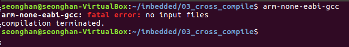

# 3강 요약

#### 2016116563 윤성한

# 1. ARM cross compiler 설치 및 구동

```
강의요약을 시작하기에 앞서 cross compiler가 무엇인가에 대한 좀 더 정확한 이해를 하기 위하여 조사해본 결과 다음과 같은 문장으로 정리된 것을 알수 있었습니다.

크로스 컴파일러(cross compiler)는 컴파일러가 실행되는 플랫폼이 아닌 다른 플랫폼에서 
실행 가능한 코드를 생성할 수 있는 컴파일러이다. 크로스 컴파일러 툴은 
임베디드 시스템 혹은 여러 플랫폼에서 실행파일을 생성하는데 사용된다.

즉, 크로스컴파일러를 통해 필자는 임베디드시스템상에서 가상으로 컴파일을 할 수 있겠습니다.

우선 아래의 링크를 통하여 cross compiler을 다운로드 받습니다.
```

<https://developer.arm.com/tools-and-software/open-source-software/developer-tools/gnu-toolchain/gnu-rm/downloads>

```
필자의 경우 리눅스 64bit 운영체제를 사용하고 있으므로 다음 사진에 해당하는 파일을 다운로드 하였습니다.
```


``` 
정상적으로 다운로드가 완료되었으면 자신의 Downloads 디렉토리에 파일이 압축된 상태로 있습니다. 여기서 gcc-arm-none-eabi가 바로 필자가 사용할  크로스컴파일러입니다.
압축된 파일을 풀기 위하여 다음과 같은 포맷의 명령어를 사용합니다.

tar -jxvf [file name]
```


* Cross compiler를 압축 해제 한 모습


```
이상없이 압축해제를 하였고 구동이 잘되는지 컴파일러를 구동시켜보겠습니다.

우선 압축해제한 폴더에 들어가서 하위폴더중 bin 디렉토리에 들어갑니다 
그곳에는 많은종류의 컴파일러가 있는데 이 중 필자는 gcc를 사용할 것입니다.
```

* ./arm-none-eabi-gcc를 입력 후 출력된 결과 확인


```
이상없이 구동됨을 확인하였습니다.
```

---------

---


# 2. ARM Emulator (QEMU) 설치 및 구동 

```
ARM Emulator을 사용하기 위해 역시 다음 링크를 통하여 QEMU를 설치해줍니다.
```

<https://xpack.github.io/qemu-arm/install/>

```
상단의 가장 최신버전 에뮬레이터를 다운로드하여 줍니다.
```


```
tar.bz2로 압축되어 있으므로 역시나 같은 방법으로 압축을 해제 하여줍니다.
```

* 압축해제를 하여 줍니다. (gzip명령어로도 가능하다고 함)


```
압축해제가 완료되면 이번에도 역시 해당폴더에 들어가 하위 디렉토리의 bin에서 QEMU를 실행해봅니다.
```


```
물론 가상보드나 MCU가 없어서 작동을 하지는 않습니다.
```


---

---

# 3. 환경변수 설정 원리

```
지금부터는 환경변수를 설정하여 현재디렉토리에 다음 두파일이 없더라도
gcc-arm-none-eabi와 xpack-qemu 두가지를 사용할 수 있도록 하는 과정과 원리를 설명하겠습니다.
```

* gcc-arm-none-eabi을 환경변수 설정없이 실행 시킨 모습 (번거로움)


```
우선 gcc-arm-none-eabi를 사용하려면 위와같이 압축해제한 파일에 접속하고 bin 내부에서 현재 디렉토리 내부의 파일을 실행하듯이 ./arm-none-eabi-gcc를 입력하는 꽤나 귀찮은 과정을 거쳐야 합니다. qemu도 역시 마찬가지입니다.

따라서 어디서든 사용할 수 있도록 환경변수를 등록할 것입니다.
이 과정을 사용하면 놀랍게도 해당파일이 아닌 아무 디렉토리에서나 실행이 될것입니다.
```

---

```
환경변수란 os입장에서 해당 프로세스를 실행시키기위해 참조하는 변수이며 이와 같은 환경변수 중에서 컴퓨터를 쓴다면 자주 마주칠 법 한 변수가 하나 있는데 그것이 바로 PATH라는 이름의 변수입니다. 이 PATH변수는 운영체제가 어떤 프로세스를 실행시킬때 그 경로를 찾는데 이용됩니다.

필자는 리눅스 shell에서 bashrc 설정을 통한 PATH설정을 할것입니다.
```


```
우선 위의 사진처럼 vi 에디터를 사용하여 bashrc에 접근하여줍니다.

bashrc 파일을 열고 가장아래로 내려간다음(:$ 사용하면 빠릅니다.)
다음사진과 같은 내용을 작성 해줍니다.

요약하여 설명하자면 alias란 긴 명령어를 간소화하여 다른 이름으로 사용할 수 있도록 해주는 shell 내부 명령어이며 뒤에 나올 긴 명령어들을 간단히 PATH로 간소화 해줍니다. 

필자는 위에서 압축 해제를 한 QEMU와 Cross compiler을 어디서든 사용하기 위하여 PATH로 설정하였습니다.
따라서 해당 디렉토리의 Full path를 다음 사진과 같이 복사하여 작성 해주었습니다.
(Tip. 복사하고싶은 내용을 지정하고 스크롤 버튼을 눌러주면 바로 복사가 됩니다!)
```


```
작성 후 :wq로 잊지않고 저장을 해줍니다.
마지막으로 path설정이 잘되었는지 확인하기위하여 커맨드라인에 echo $PATH를 입력하고 환경변수들의 경로인 path를 출력해보았습니다.
```


* 이상없이 PATH가 잘 적용된 모습을 출력으로 확인하였습니다.



```
놀랍게도 처음위치가 아닌곳에서도 실행이 됩니다!
```


---

---------

# 4. ARM firmware project file 분석

```
다음으로는 수업시간에 제공된 makefile, startup.s, load script와 임의로 만든 main.c에 대한 분석입니다.
```

### Makefile


```
보기에 굉장히 복잡해보이지만 하나씩 차근차근 해석해보았습니다.

CC= arm-none-eabi-gcc
LD= arm-none-eabi-gcc
OBJCOPY = arm-none-eabi-objcopy
 
CFLAGS= -mcpu=cortex-m4 -mthumb -mfloat-abi=hard -mfpu=fpv4-sp-d16 -DSTM32 -DSTM32F4 -DSTM32F411VETx -DSTM32F411E_DISCO
CFLAGS += -DDEBUG -DSTM32F411xE -DUSE_STDPERIPH_DRIVER -O0 -g3 -Wall -fmessage-length=0 -ffunction-sections -c -MMD -MP

LFLAGS= -mcpu=cortex-m4 -mthumb -mfloat-abi=hard -mfpu=fpv4-sp-d16 -T"LinkerScript.ld" -Wl,-Map=out.map -Wl,--gc-sections

-> 긴명령어들을 '매크로'로 등록하여 아래 make실행 부분에서 쉽게 쓰도록 변경하는부분입니다. CC, LD등은 보통 사용할 GCC컴파일러를 매크로로 지정할때 사용합니다.
 
all:
	$(CC) $(CFLAGS) main.c
	$(CC) $(CFLAGS) startup.s
	
	$(LD) $(LFLAGS) -o out.elf main.o startup.o

-> main.c 와 startup.s를 Crosscompile하고 object파일들을 linker을 통하여 묶어주는 부분입니다. 이때 링커스크립트를 사용하는 것을 확인할 수 있었습니다.

bin:
	$(OBJCOPY) -O binary "out.elf" "out.bin"

-> Crosscompiler 내부의 objcopy(arm-none-eabi-objcopy)를 통하여 out.elf에서 out.bin으로 복사하는 부분입니다.
*elf란? : Executable and Linkable Format의 약자

qemu:

qemu-system-gnuarmeclipse --verbose --verbose --board STM32F4-Discovery --mcu STM32F407VG --gdb tcp::1234 -d unimp,guest_errors --semihosting-config enable=on,target=native --semihosting-cmdline out

-> qeme를 사용, 즉 에뮬레이터를 가동시키는 명령어입니다. 해당보드(STM32F4)등의 정보가 기입되어 있음을 볼 수 있습니다.
```

### main.c


```
이후에 에뮬레이터에서 구동을 할때 무한 루프에 걸리도록 코딩해놓은 상태입니다.
gdb부분에서 추가로 설명하겠습니다.
```

### startup.s

```
사용자의 피시에 전원을 넣으면 한참 동안 뭔가를 하다가 윈도우가 나타납니다. 이런 과정을 부팅이라고 말합니다. 이처럼 임베디드 시스템도 부팅을 하는데, 부팅 과정 중에서 가장 첫 번째 단계를 맡고 있는 파일을 일반적으로 스타트업 파일(Startup.s)이라고 합니다.
```

* Startup.s 파일에 대한 이해를 돕기 위해 참고하였던 그림


* 제공된 startup.s의 코드내부


```
startup.s파일에서는 인터럽트, 메모리 컨트롤 레지스터, 스택어드레스 할당 등 임베디드시스템 부팅시에 필요한 것들을 설정해줍니다.
```

### Load Script

* Makefile의 일부


```
위의 그림처럼 make를 할때 우선 컴파일러로 c파일과 startup.s파일을 컴파일합니다. 그러면 main.o와 startup.o가 생성이 될 것입니다.
여기서 15번째줄을 보면 링커를 통하여 여러 object file들을 하나로 합치는 역할을 합니다. 이때 링커스크립트를 사용하게 되는데 링커 스크립트의 주목적은 입력파일의 섹션이 어떻게 출력파일로 대응하는지와 출력파일의 메모리 상태를 어떻게 조정하는지를 지정하는 것입니다.
```


```
위의 그림처럼 링킹을 할때의 설정을 지정 해줍니다
예를 들어 MEMORY명령에서는 메모리 블럭의 시작주소와 해당블럭의 크기를 설정합니다.
여기서는 RAM과 ROM의 크기와 시작주소를 설정해놓은 것을 확인할 수 있었습니다.
```

---

---

# 5. QEMU에 펌웨어 로딩

```
모든 준비과정(path설정 파일 다운로드 등)이 끝났다면 이제 make를 통하여 만들어놓았던 명령어들을 한번에 실행 시킵니다. 
```


```
또한 make bin을 입력하여 elf파일을 bin으로 복사하여줍니다.
```


```
이 과정을 통하여 make qemu로 out.bin을 올려 에뮬레이터를 가동시킬수 있습니다. 마지막으로 make qemu를 입력하면 매크로에서 지정해놓은 Cortex -M4시리즈 STM32F40VG가 실행됩니다.
```

* make qemu를 입력하자 make파일에 매크로해놓은 대로 에뮬레이터가 구동


* 다음과 같이 에뮬레이터가 구동됨


```
여기서 구동된 에뮬레이터의 리셋버튼을 마우스로 클릭하자 에뮬레이터에서 반응이 오는것을 확인할수 있었습니다.
```

* 검은색 리셋버튼을 누른 후 에뮬레이터의 반응


---

---


# 6. gdb를 이용하여 타겟보드(에뮬레이터)에 접속하여 코드 실행 및 Tracing

```
다음은 에뮬레이터를 실행한 상태로 gdb를 이용하여 타겟보드에 접속하여 코드를 실행해보았습니다. 
make gdb를 입력하여 실행 시켰습니다.
```

* make gbd


```
이후 타겟보드에 접속하기 위해 다음과 같은 명령어를 입력하고 main.c를 실행 해보았습니다.
```

* target remote 127.0.0.1:1234 입력 (호스트)


```
성공적으로 타겟보드에 접속하였고 out.elf파일을 올립니다
file out.elf 와 load를 사용하여 임베디드시스템을 위해 make로 만들었던 파일들을 올립니다.
```


```
마지막으로 처음에 만들어 놓았던 무한루프 main.c파일을 breakpoint를 통해 tracing합니다. 명령어는 b(reakpoint) main이며 n을 누르면서 main파일이 무한루프에 빠져있는지를 확인하였습니다.
```


```
main을 한 라인씩 읽어들이며 breakpoint check를 합니다. 아까 만들어놓은 main은 무한루프이기 때문에 예상대로 while구문에서 영원히 갇혀버리게됩니다.
이를 빠져나오려면 ctrl + c를통해 프로세스를 죽이면 됩니다.
마지막으로 커맨드 입력창에 q를 입력하여 gdb를 종료합니다.
```

* gdb를 종료하는 방법


---

---


# 7. gdb를 써보면서, 칩 내부의 동작을 확인하면서 어떻게 실행되는지 분석 (main.c에 간단한 알고리즘 구동하는 코드 삽입필요)

* 사용한 main.c (위의 그림에서 int b를 추가하여 load할 때 무엇이 바뀌는지 비교)


```
에뮬레이터와 gdb사이의 연관관계를 알아보기위하여 두 창을 띄어놓고 번갈아 가며 비교해보았습니다. 링커 스크립트의 SECTION 부분에서 선언하였듯이 isr_vector을 size 0x18c만큼 할당하고 .init과 .fini를 0x4 씩 할당합니다.
가장 마지막에 있는 .text.main은 실험해본결과 main.c를 수정할때마다 값이 조금씩 바뀌는걸로 봐서 main의 text를 위해 메모리를 할당하는 부분이라고 이해하였습니다. ex) main.c에 int b를 추가하자 12bytes할당에서 16bytes할당으로 늘어났음.
```


---

---

reference :<http://recipes.egloos.com/5317479>

<https://www.google.com/search?q=linux+xpack-qemu-arm&tbm=isch&ved=2ahUKEwj-_eHXhNvvAhUPQfUHHbftAl8Q2-cCegQIABAA&oq=linux+xpack-qemu-arm&gs_lcp=CgNpbWcQAzoFCAAQsQM6AggAOggIABCxAxCDAToHCCMQ6gIQJzoECAAQAzoECAAQEzoICAAQCBAeEBM6BggAEAgQHjoECAAQGFCD2QFYtcUCYOjIAmgFcAB4AYABqAKIAfsekgEGMS4yNi4xmAEAoAEBqgELZ3dzLXdpei1pbWewAQrAAQE&sclient=img&ei=t65kYL7GIo-C1e8Pt9uL-AU&bih=600&biw=593>

