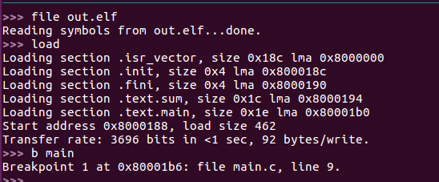
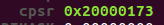

# 4강  C코드가 ARM 프로세서에서 구동되는 원리 이해

#### 2016116563 윤성한

```
이번에는 C코드가 ARM 프로세서상에서 구동되는 원리를 이해하는것이 목표입니다. C코드를 ARM cortex-m4 프로세서용으로 컴파일하고, 이를 프로세서 위에 로딩 후 온칩에서 실행되는 과정을 분석하는것이 목표이며 이과정에서 C로 코딩하는 다양한 사례별로 몇가지 예시 코드를 짜서 assembly code로 변환되어 실행되는 원리를 분석하고 opcode를 구글에 검색해 각 instruction의 의미를 학습하는 것입니다.
```


# 1. 예시코드 분석 전 준비과정

```
예시코드를 만들고 분석하기 전에 우선적으로 저번시간에 했던 에뮬레이터 구동과 크로스컴파일 실행을 하여 분석준비를 하는 과정부터 시작하겠습니다.

지난시간과 다른점은 gdb-multiarch를 설치하여 좀더 직관적으로 분석을 할수 있게 하는것 입니다.
```

### 1.1 gdb-multiarch 설치

```
sudo apt-get install gdb-multicrch 를 입력하여줍니다.
```


```
정상적으로 설치가 되었으면 제공받은 makefile에서 gdb-multiarch를 사용함을 레이블에 추가해줍니다.
```


### 1.2 makefile을 이용한 컴파일링 및 에뮬레이터 구동

```
make all을 하게 되면 main.c와 startup.s를 크로스컴파일을 하여 obj파일을 생성하게 되고, 이를 링킹하여 out.elf로 만들어줍니다.
이때 현재 디렉토리에 교수님께서 제공한 LinkerScript가 링킹할때의 길잡이 역할을 해주게됩니다.
```


```
지난 시간에 했던 것 처럼 qemu 에뮬레이터를 실행하고 다른창을 하나 더 열어서 gdb를 실행할 것 입니다.
```

* 에뮬레이터 구동


### 1.3 gdb 실행

```
아직 main.c를 수정하지 않았지만 gdb로 실행하는 모습까지만 해보았습니다.
main.c는 현재 지난시간에 했던 내용이 남아있으나, 코드분석에 대한 내용들은 아래에서 후술하겠습니다.
```


```
위처럼 에뮬레이터에 연결 하였습니다 좀 더 직관적으로 사용하는 레지스터나 스택포인터 메모리 등을 확인할 수 있음을 확인하였습니다.
```



```
최종적으로는 위에서 만들어진 out.elf를 gdb-multiarch를 사용하여 분석하는 것이 목표입니다.  
이때 실행되는과정을 step instruction 추적을 통하여 분석할 것입니다.
```

---

---


# 2. Step Instruction 추적을 통한 실행과정 정밀분석

``` 
지금부터는 본격적으로 main.c코드를 다양한 사례별로 제가 작성하여 이것이 assemble code로 변환되었을 때에 ARM 프로세서에서 어떤식으로 작동하는지를 Step Instruction 추적을 통하여 분석해보겠습니다.

제가 작성할 main.c에는 변수에 값 저장, 변수끼리 더하기 빼기, if, else, for, 함수 call 등 c언어에서 사용되는 내용들을 포함할 것 입니다.
```

---


###  2.1  비트마스킹

```
지난시간에 배운 내용이므로 잠깐 요약하고 가겠습니다.
```


```
위와 같은 c파일이 있습니다.
P0에 0x95 => 즉 10010101을 넣고 이를 비트마스킹을 통하여 5번째 비트를 수정하여 0x85 => 10000101로 만드려고 합니다. 
11101111을 and 연산하여도 되지만 00010000 즉 0x10을 not을 주어 and를 하여도 결과는 같습니다.(좀 더 직관적이게 됨.)
```

---


### 2.2 Step instruction 추적을 통한 분석

```
위의 코드를 수정하여 변수에 값 저장, 변수끼리 더하기 빼기, if, else, for, 함수 call등을 추가하여보았습니다. 

시작하기에 앞서 몇가지 기본적으로 알고 가야 할 점이 있습니다.

1. 추적 명령어
명령창에 n 과 si 두가지를 사용하여 Step instruction 추적을 할 수 있습니다. "n"은 c언어 상 코드 한 줄씩 이동하여 "si"는 pc의 위치에 따라 assembly언어를 한 코드 씩 추적할 수 있습니다. 따라서 저는 si 명령어를 사용하여 좀 더 세부적으로 분석 해보겠습니다.
또한 db memory watch "주소" 명령어를 사용하여 메모리의 세부내용을 확인할 수 있습니다.
```


```
2. pc (program counter)
32bit register라고 가정했을 때 pc카운터가 보통은 4(byte)가 증가하는데 이번 분석을 할때에는 2씩 증가합니다. 왜냐하면 ARM에서는 thumb모드(저전력 고효율방식)가 존재하는데 이를 사용하고 있고 이는 16비트이기때문에 2byte씩 넘어가는 것을 확인할 수 있습니다. 위 그림을 보면 makefile상에서 thumb-mode를 사용함을 알 수 있습니다.

3. Thumb 모드 / ARM모드
위에서 기술한 것처럼 arm에는 2가지 모드가 존재합니다.
ARM 자체가 모바일/임베디드 등 PC 와는 다른 환경에 맞춰서 설계했기 때문에 저전력, 고효율이 핵심 기술 중 한가지였고, 또 한가지로 처음 설계될 당시 임베디드 계열에서는 32비트가 아닌 16비트가 대세였다고 합니다. 이러한 여러가지 상황에 맞추기 위해 2가지 모드를 지원하게 되었습니다.

출처: https://hyunmini.tistory.com/80 [Hyunmini]
```

### 분석 시작

```
지금부터 본격적으로 분석을 해보겠습니다.
```


```
위와 같은 c파일이 있습니다.
변수에 값 저장, 변수끼리 더하기 빼기, if, else, for, 함수 call에 관한 내용이 한번 이상 사용 되도록 작성하였습니다.
```


```
crosscompile을 하고 위 그림처럼 elf파일을 로드해줍니다.
```


```
int main()한줄에도 어셈블리어가 3개나 달려있습니다.
하나씩 해석해보겠습니다.

push {r7, lr}

** 범용 레지스터 r14는  특수레지스터 lr로 사용 됩니다. lr은 함수 호출 시 되돌아갈 함수의 주소가 저장되는 레지스터입니다.

-> opcode PUSH는 32bit ARM 명령어와 16bit THUMB 명령어로 나누어 집니다 먼저 32bit ARM 명령어에서 Push는 stmdb 이고, 16bit THUMB 명령어에서는 Push는 push입니다. 여기서는 THUMB모드이기때문에 push를 사용합니다.

여기서 메모리의 스택영역은 함수의 호출과 관계되는 지역변수와 매개변수가 저장되는 영역입니다. main함수를 사용하기 위해 push동작으로 다시 돌아올 r7의 주소(데이터)를 저장하려고 하는 모습을 볼 수있습니다.

```


```
sub  {sp, #16}
-> opcode sub는 차감 연산이며 sp에서 16bit를 빼서 그만큼 사용하려는 모습입니다.
** 범용 레지스터 r13 은 특수레지스터 sp로 사용되며 sp는 C언어 사용시 스택의 주소를 저장하는 레지스터입니다.
스택 영역은 메모리의 높은 주소에서 낮은 주소의 방향으로 할당됩니다.

add  {r7, sp, #0}
->opcode add는 합 연산이며 0을 더하기 때문에 의미가없고 여기서는 sp주소 값을 r7에 옮기는 역할만 하고 있습니다.
```

 


``` 
돌아갈 주소등을 다 저장해놓았기때문에 이제 레지스터에서는 연산만 빠르게 진행하여 반환하면 될 것 입니다. 

movs r3 #149 
-> 즉 0x95를, r3에 넣습니다 여기서 r3 레지스터는 c언어 상에서 P0입니다.

strb r3 [r7, #7] 
-> byte크기의 값을 레지스터에서 메모리로 저장을 하는 opcode입니다. 
r7에서 +7byte만큼 떨어진곳에 r3를 저장한다는 의미입니다.
```


```
다음 구문으로 넘어갑니다. c언어상에서는 5번째 비트를 클리어하는 부분입니다.
ldrb r3 [r7, #7]
-> 메모리에서 레지스터로 바이트만큼 로드하는 opcode입니다.
위에서 저장하였던 P0의 위치에서 다시 r3로 가져오는것을 확인할 수 있습니다.
```


```
bic.w r3 r3 #16
-> bic:해당 비트를 클리어 해줍니다 여기서는 0x10이므로 5번째 비트 2^5
즉, P0가 저장된 r3에서 즉 16bit를 클리어해주는 모습입니다.
```

* 값에서 16bit가 빠져 메모리에서 7번째 위치에는 그 값이 0x95에서 0x85로 변경되었음을 db memory watch 명령어를 사용하여 확인할 수 있었음. (아래 그림)


---

---

### 함수호출

* 이번에는 함수 호출시의 assembly를 분석하겠습니다.


```
c코드상에서 sum 함수를 호출합니다.
```


```
main의 assembly상에서 3과 4를 r1, r0레지스터에 저장하고 
bl 0x8000194, 즉 sum 함수가 실행되는 주소로 넘어갑니다.
bl은 서브루틴 호출명령입니다.
여기서 중요한점은 bl은 큰 주소로 점프를 해야하기때문에 THUMB모드 16비트로는 표현이 힘듭니다. 따라서 여기서는 32비트 까지 불러와서 이용합니다.
```


```
r7주소 값을 push하고 sp값주소에서 12만큼 공간을 할당해줍니다. sp값을 r7에 복사하고 여기서 파라미터로 사용할 int a 와 b는 4byte이므로 각각 r7에서 4씩 떨어지게 r0 과 r1 레지스터에 store합니다.
```


```
아까 저장해놓았던 r7에서 0~3 4~7바이트 두가지를 각각 r2레지스터와 r3레지스터에 load합니다. 그리고 r2값을 r3에 합쳐서 r3에는 7의 값이 담기게 됩니다.
```


```
함수를 종료하고 값을 반환하기 위하여 r3값을 r0에 복사합니다. 그후 아까 빌려왔던 12byte를 다시 반환하기 위해 r7에 더해주고 그값을 sp에 써줍니다
여기서 .w가 나오게되는데 명령어상에서 ldr과 큰 차이는 없습니다. 그저 arm 의 THUMB모드에서 32bit instruction을 사용하겠다는 의미로 해석됩니다. 즉 명령어 크기로 4byte를 쓰겠다는것입니다.
마지막으로 bx lr은 서브루틴 복귀로써 lr의 값을 pc에 저장하여 다시 호출한 위치로 돌아갑니다.
```


```
함수가 종료되는 시점에서 r7에서 12만큼 떨어진주소에 r0를 저장합니다.
r0는 여기서 최종 반환된 값 7이고 c언어상에서 result에 저장된것과 같은뜻입니다.
```

---

---

### if else 구문

* 이번에는 if else 구분이 컴파일되어 어셈블리상에서 어떻게 동작하는지 살펴 보았습니다.


```
c코드 상에서는 위와 같이 짜여 있으며 위에서 저장된 result, 즉 r0를 계속 가져와 사용합니다 result가 7이기 때문에 if문에서 해당되는 곳으로 branch할것으로 예상하였습니다.
```


```
r7에서 12 떨어진곳의 값을 r3로 load합니다. 이 값은 위에서 저장하였던 result와 같은 값입니다. 이어서 cmp명령어로 r3에서 6을빼어 그 결과를 Status flag에 반영합니다. 
```




```
cpsr에 그 결과가 반영되었습니다. 여기서 cpsr은 psr(program status register)의 한 종류로 32bit로 구성되있으며 위 그림과 같은 구조로 구성됩니다. 
가장앞의 conditional flag -> 8에서 2로 바뀌었고 이는 0010 즉 negative가 아니게됩니다. 다음 ble 구문에 영향을 주게됩니다.
그다음 ble 즉 왼쪽 r3가 6보다 작거나 같으면 0x80001da로 점프를 하는 부분입니다. 여기서는 r3가 7이기 때문에 해당되지않고 그냥 넘어갑니다.
```


```
if문의 조건에 걸린 상태이므로 따라서 result += 1; 이 실행될 것입니다.
r7레지스터에 담긴 주소 에서 12번지에 저장된 값(= result)를 r3레지스터에 임시 저장해놓고 1을 더합니다. 이를 다시 불러온곳으로 store해줍니다.
그리고 아래의 else 부분의 assembly부분을 실행하지않고 다음 c코드 부분으로 branch합니다.
```

---

---

### for 반복문


```
이번에는 for문이 assembly상에서 어떻게 실행되는지를 분석하였습니다.
movs r3 #0 
-> r3에 0을 넣습니다. c 코드상의 int i=0을 지정해주는 부분입니다.
str r3 [r7 #8]
-> r7에서 8떨어진 곳에 r0를 저장합니다.
b.n 
->무조건 분기로 위에 해당되는 주소로 점프합니다.
```


```
이 코드는 c언어상에서 i<3인것을 비교하는 부분입니다. r3 와 2를 비교하여 
왼쪽(r3)가 2보다 작거나 같으면 위의 주소로 branch합니다. 
```


```
for문에서 갇힌 상태이므로 for문 조건안의 수행 코드 result +=1을 수행해야합ㄴ디ㅏ.
r7에서 12만큼 떨어진곳에 저장해놓았던 값(result)를 임시레지스터 r3에 잠깐 불러와서 1을 빼고 다시 돌려놓습니다.
```


```
여기서부터는 위의 내용이 반복됩니다. sp주소에서 8떨어진 곳의 값, 즉 int i의 값이 2와 비교했을때 2보다 작거나 같아지면 비로소 if문을 탈출하게 됩니다.
```

---

---

* 추가) 만약 result값이 7보다 크지않아  else로 들어가게 된다면

```
위의 for문을 사용하여 result값을 줄였으므로 다시 if else구문으로 7초과일경우와 아닐경우로 분기시켜 실험해보았습니다.
```


```
위의 for문으로 result값이 5로 바뀌었으므로 else로 들어갈 것입니다.
그리고 이번에는 >= 가아니라 >로 비교하였으므로 assembly상에서 조금 다르게 나타납니다.
```


```
result를 불러오고 이번에는 6이아닌 6과 비교하는 모습입니다. 
```


```
여기서는 cpsr가 8 즉 1000이되었고 negative인 상태입니다. ble.n 명령어에 해당되기때문에 다음 주소로 branch할 것입니다.
```


```
최종적으로 result에 -1을하고 다시 원래위치로 돌아오는 모습입니다.
```

* 고찰

```
위와 같이 c언어에서 사용되는 다양한 사례별를 assembly코드 상에서 분석해보았고 함수의 call, return과정에서 stack메모리와 레지스터와의 관계, 그리고 THUMB모드에서의 동작등을 잘 알 수 있었습니다. 
또한 CPU 와 레지스터 메모리가 어떻게 상호작용하고 임시레지스터는 주로 어떤것이 사용되며 특수레지스터(SP, PC, CPSR 등)는 무엇이 있는지 상세한 분석을 해보며 잘 학습할 수 있었습니다.
```


---

---

reference :<https://kyuhyuk.kr/article/simple-arm-operating-system/2019/03/04/Simple-ARM-Operating-System-Chapter-2>

<http://www.jkelec.co.kr/img/lecture/arm_arch/arm_arch_4.html>

<http://recipes.egloos.com/v/5651064>