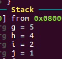
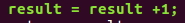
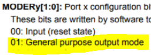

6강 함수 실행흐름 정리 및 polling 기반 GPIO,  입출력 처리분석

#### 2016116563 윤성한

```
4/15일 수업에 대한 요약 정리입니다.

목표
1. CPU, Register, RAM의 상호작용 측면 분석
(실습예제 작성 후 Cortex-m4로 생성된 어셈블리코드 분석)

2. GPIO 입출력제어와 MCU(STM32F)을 비교해가며 데이터시트의 내용이 어셈블리 코드상에서 어떻게 표현되고있는지 분석
```


# 1. CPU, Register, RAM의 상호작용 측면에서의 분석(실습 예제 기반)

``` 
우선 수업시간에 이론으로 진행해보았던 코드를 직접 컴파일하여 CPU, Register, RAM의 상호작용 측면에서의 분석을 진행하여보았습니다.

실제로 제공된 강의자료와 비슷하게 어셈블리어로 생성되는지 확인을 하고 메모리상에서 어떤 레지스터가 어떠한 역할을 하며 서로가 어떠한 영향을 미치는지 분석해보았습니다.
```

* main.c 작성


```
수업시간의 예제 코드를 작성하여 실제 학습한 이론내용과 일치할지 복습해보았습니다.
```

* Makefile에서 cortex-m4인지 다시 한번 확인을 하였습니다.


```
make qemu를 입력하여 에뮬레이터를 구동하고 make gdb를 입력하여
분석할 준비를 마칩니다.
```

* 분석시작


```
gdb multi arch를 실행하고 main을 올립니다.
```


```
Stack Frame: Local variable allocation on the data memory

가장 처음에 sp는 어딘가를 가리키고 있는 상태입니다. 여기서는 0을 가리키고 있습니다. 추후에 한번 더 기술하겠지만 MCU가 POWER ON 될 때 LinkScript를 통하여 스택포인터가 초기화됩니다. 따라서 현재 값은 0입니다.

push {r7, lr}
r7은 main 함수를 호출한 부분의 sp입니다. 추후에 복원하기 위해 현재 sp위치에 저장합니다.(메모리에 백업하는 부분)

lr은 함수 호출 시 되돌아갈 함수의 주소가 저장되는 레지스터로서,
돌아갈 코드메모리의 위치를 알려주고있습니다.

sub sp #24 
sp에서 24바이트만큼 옮겨서 해당 main 함수에서 사용할 변수의 크기를 할당합니다. 참고로 스택은 메모리의 높은주소에서 낮은주소로 커집니다. 따라서 사용할때 sub 명령어를 사용합니다.

add r7 sp #0
해당 명령어에 의해 r7에는 sp + 0 의 값이 들어가게됩니다.
```


```
따라서 r7에는 sp의 값이 들어있으며
```


```
lr에는 돌아갈 주소값이 설정되어있습니다.
```

* 변수에 값을 지정하는 부분


```
Storing value into local varialbes

movs r3 #5
str r3 [r7, #20]
movs r3 #4
str r3 [r7, #16]
movs r3 #2
str r3 [r7, #12]
movs r3 #1
str r3 [r7, #8]

r3레지스터에 5,4,2,1을 임시저장하고 그 값을 r7가 가리키는 위치 에서 20,16,12,8byte 떨어진 곳에 저장합니다.
이때 4byte씩 떨어져서 저장하는데 이는 int값이 4byte이기때문입니다.
```


```
다음은 foo에서 사용할 argument 값들을 사용할 레지스터에 옮깁니다.
```


```
위의 r7(변수가 저장된 메모리를 가리키고있는 주소)에서 각각 8, 12, 16, 20씩떨어진 부분으로부터의 값(d0, d1, d2, d3)을 r3, r2, r1, r0으로 load합니다.

그리고 bl구문을 통하여 foo함수가 있는 주소로 점프 뜁니다.
bl 명령어가 실행될때 pc값에는 foo 값이 저장되며 돌아갈 위치를 lr에 저장합니다.
```


```
이번에도 역시 foo함수를 사용하기위해 r7레지스터값을 push합니다.
그 후 사용할 만큼의 공간 28byte를 할당하고 그 값을 레지스터 상에서 사용하기위해 r7에 저장합니다. 아래 사진을 통해 직관적으로 이해하였습니다.
r7주소를 offset으로 하여 foo함수에 사용되는 변수들에게 접근할 수 있겠습니다.
```




```
레지스터 r0, r1, r2, r3 로부터 stack에 5 4 2 1 가 담기게됩니다.
```


```
r7으로부터 12, 8 떨어진 값을 r2, r3레지스터에 담고 
add r2 r3합니다. 
따라서 5 + 4 = 9 가 r2에 담기게 됩니다.
```


```
역시 마찬가지로 2 + 1 = 3이 r3에 담기게 됩니다.
```


```
sub r3 r2 r3
즉 r2에서 r3값을 뺀것을 r3에 저장하고 (9 - 3 = 6)
str r3 [r7 #20]
r3값을 r7에서 20byte떨어진 곳에 저장합니다.
```


```
f를 반환하여 다시 main에서 사용 할것이기때문에 저장했던 값을 다시 r3로 가져옵니다.. 따라서 r3에는 6이 저장되있습니다.
```


```
foo 함수에서의 모든 일이 끝났으므로 돌아갈 준비를 합니다

mov r0 r3 
r3값을 r0로 옮깁니다.

adds r7 #28
r7에 28byte를 더합니다.(이것을 하는 이유는 sp와 같은 역할을 했고 이전 주소로 돌아가기 위해서임)

ldr.w r7 [sp] #4 
이번에는 r7에 sp에서 4byte떨어진 값을 load해옵니다. 즉 원래 함수의 스택포인터로 복귀합니다.


bx lr 
링크레지스터의 값으로 돌아값니다. 즉 함수 호출 시 되돌아갈 함수의 주소로 돌아갑니다.
아래 그림처럼 bl foo 에서 lr에 저장된 주소로 반환되며 pc값은 다음 실행될 코드메모리로 이동합니다.
```


* foo 함수 종료




```
foo 함수에서 연산된 값이 반환된 값(=6)이 result에 들어있으며
r7 에서 4만큼 떨어진곳에 저장되어있습니다 
ldr 명령어를 사용하여 이를 가져온후 1을 더하여 그자리에 반환합니다.
(6 + 1 = 7)
이때 db memory watch명령어를 사용하여 r7주소값을 입력해보면 
4번째 위치에 7이 저장되어 있을 것입니다.
```

* 메모리에 store 전


* 메모리에 store 후


```
4byte 뒤에 07 의 값이 저장된 것을 확인하였습니다.
```

* Cleaning stack frame for main function


```
모든 과정이 끝나면 fp에 24(처음에 빌려왔던 만큼)를 더하고 그값을 sp에 넘겨줍니다.
그리고 pop하여 sp가 가리키는 위치가 읽고 쓰는 대상에 돌아갑니다.
이때 pc는 코드메모리를 가리키는 주소입니다.
```

* 이상으로 Data Memory - Register Interactions에 관한 고찰을 마칩니다.

---

---


# 2. GPIO 입출력 제어와 관련한 STM32F Data sheet Analysis

* 사용하고있는 에뮬레이터는 STM32F4 시리즈입니다.


### 2.1 LinkerSciprt & Data sheet

```
우선 GPIO에 관련된 데이터시트를 찾아보기전에 
MCU가 가동되고나서 가장 먼저하는작업인 Stack Pointer(이하 SP)초기화 작업에 대해 요약하였습니다.
SP는 특정 값들을 임시저장을 위한 용도로 사용되는데, 
C 언어에서 변수를 넘기거나 함수안에 정의된 로컬변수들을 사용할 때 이용됩니다. 

저는 LinkerScript.ld 파일부터 열어보았습니다.
```


```
LinkerScript.ld에는 
-estack = 0x20020000; 이라고 작성되있으며
RAM의 가장 높은 주소라고 되어있습니다.
이것이 무엇을 의미하는 것인지 좀 더 조사해보았습니다.
```


```
STM32F4 Datasheet를 찾아본결과 STM32F4 시리즈의 SRAM2를 사용하기 위해서는 스택의 시작주소를 부팅 시에 0x2001FFFF 값으로 초기화 시켜주어야합니다. MCU를 부팅시에는 필연적으로 startup코드가 실행됩니다.

따라서 아래 스타트업 코드를 보면
101번째 라인에 .word _estack이 있습니다.
이것은 word크기의 _estack의 주소값을 의미 합니다. 
위의 링커스크립트 파일에 보면 _estack의 주소값을 
-estack = 0x20020000; 
으로 초기화 하는 부분이 있습니다.즉 RAM의 마지막 주소로 Stack Pointer가 초기화 됨을 알 수 있습니다. 
```


```
즉 Data sheet에 적힌 값 대로 Linkerscript가 작성되어야 의도하는대로 구동이 되며 위의 경우 SRAM2를 사용하기위해 0x2001FFFF로 입력되어 있는것을 데이터시트를 통하여 확인하였습니다.
```


---

---

### 2.2 GPIO &  Datasheet

```
LinkerScript와 Datasheet사이의 관계를 확인하였고 
궁극적으로 GPIO 입출력 제어와 Datasheet의 스펙을 비교해보며 어떤 원리로 동작하는지 분석하였습니다.

코드상에서 클록설정이나 인터럽트 설정등에 관한 비트마스킹이 있었지만, 
GPIO에 대한 동작원리 요약이므로 그부분은 언급하지않고 GPIO 모드설정 및 LED설정이 Datasheet에 어떻게 표현되있는지를 공부하였습니다.


polling으로 GPIO를 입출력 하면 Interrupt에 비해 매우 비효율적이므로 임베디드시스템에는 적합하지 않습니다.
그러나 6강의 경우 polling 기반으로 펌웨어 코딩하였으므로 이를 기반으로 요약하겠습니다.
```

* GPIO 입출력 모드 설정을 데이터시트에서 확인


```
데이터시트에서 알 수있듯 MODER에 비트마스킹을하면 해당 PORT를 enble할수 있음을 알았습니다.

또한 input으로 버튼을, 그리고 output으로 초록, 주황, 빨강, 파랑 LED를 사용하는것을 결과를 통해 유추할수있습니다. 
이를 데이터시트를 통해 역추적해보면
```


```
위 사진을 보면 PD12 (PORTD 12 라는 의미)는 초록색
PD13는 주황색
PD14는 빨간색
PD15는 파란색
LED에 해당됩니다,
또한 push button은 PA0으로 연결된것을 알 수 있습니다.
```


```
우선 GPIO PORT A부분입니다.
위에서 |= 연산을 하는데 이것은 비트마스킹이라고하며 해당위치의 비트를 0이나 1로 덮어씌웁니다.
예를들어 GPIOA_MODER |= 0 << 0; 은 GPIOA_MODER 의 0번째 비트를 0으로 덮어씌우겠다는 뜻입니다. Data sheet를 통해 알 수 있듯이 0번째 비트를 0으로 마스킹 하면 GPIOA를 INPUT모드로 사용한다는 의미입니다.
```




```
GPIO PORT D부분입니다.
RCC_AMB1ENR 의 3번 비트를 1로 덮어써서 PORTD를 사용가능하게 합니다.
Data sheet를 통해 1로 비트마스킹하면 output mode로 사용됨을 알수있고
MODER에서 12, 13, 14, 15포트를 GPIO Output 모드로 사용하기위해 1을 비트마스킹해줍니다. 
모드는 4가지가 있고 이를 표현하기위해 하나의 output당 2개의 비트가 할당되어있으므로 각각 24, 26, 28, 30씩 shifting하여 마스킹합니다.
```


```
위의 사진의 경우 polling으로 계속하여 에너지를 사용하며 입력대기를 하는 중입니다. 

GPIOD_ODR |= 1<<12;의 경우

GPIOD의 12번째를 1로 비트마스킹 즉 초록 LED는 상시 켜져있다는 의미입니다.

다음은 polling부분입니다.

1. Button
GPIOA_IDR & 0x00000001
즉 GPIOA의 0번째 레지스터가 1(눌리면) 이되면 아래내용을 수행합니다.

2. LED Toggle
GPIOD_ODR ^= 1 의 경우 XOR연산을 수행하고있으며 
A XOR 1 = ~A 즉 toggle 되는 것을 알수있습니다.

따라서 위의 조건문이 실행되면 최종적으로 위에서 설정하였던 GPIOD에 의해 3가지 색깔(주황, 빨강, 파랑)의 LED가 깜빡일 것 입니다.
```


```
qemu를 가동하자 초록색 led는 버튼 누름과 상관없이 계속 켜져있고 나머지 3개의 led는 toggle되는 것을 확인할 수 있습니다.
```


* 이상으로 GPIO 입출력제어를 MCU Data sheet를 통해 비교해보며 원리를 분석해보았습니다.

---

---

reference : STM32F Reference Manual, STM User Guide

http://blog.naver.com/PostView.nhn?blogId=chcbaram&logNo=221275028829&parentCategoryNo=&categoryNo=17&viewDate=&isShowPopularPosts=true&from=search