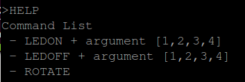

# 7강 UART 통신 과정 정리 및 custom LED 제어 쉘 구현 분석

#### 2016116563 윤성한

```
5/6일 수업에 대한 요약 정리입니다.

목표
1. UART 통신과정 요약

2. 위의 UART 통신을 기반으로 
 -시리얼 터미널로 LED 제어하는 쉘 만들기
 -동작하는 시리얼 터미널 창 (gtkterm) example 사진
```


# 1.  UART 통신과정

``` 
통신프로토콜에는 여러가지 종류가 있습니다.
그 예로 UART SPI I2C CAN 등 이 있는데 
이번시간에는 이들중 UART와 gtkterm을 사용하여 컴퓨터와 보드간의 통신을
실습해보고 정리하였습니다.

-용어정리-
UART(Universal Asynchronous Receiver Transmitter)란 범용 비동기화 송수신의 약자로 연결라인이 하나여서 구조적으로 간단하고 양단간 송수신 거리가 멀어도 제한이없다는 특징을 가지고있습니다.
컴퓨터의 발전과 동시에 개발되어 역사적으로 매우 오래되었으며 그만큼 널리쓰였습니다.
비슷하게 USART 통신이 있으며 둘의 차이는 동기와 비동기의 차이입니다 
즉 클락 신호에 동기가 되느냐 안되느냐의 차이이며 USART를 사용할 것 이므로 추후에 CLK신호 인가 내용이 포함되어있음을 확인할 수 있습니다.
```

* 개요

```
STM보드의 PA2, PA3을 USART모듈과 연결하고 컴퓨터에서 입력되는 명령들에 대해 인터럽트로 처리하는것을 목표로 합니다.
1. 실행 시 제공된 uart_data[] 아스키 코드를 gtkterm에서 출력 
2. 사용자가 타이밍하는 글자를 echo로 돌려서 화면에 출력 (Interrupt!!)
```

* 준비물

```
지난 시간과 마찬가지로 STM32보드를 사용합니다. 
추가로 UART 통신을 가능하게해주는 USB to UART ic인 FT232가 필요합니다. 
```


```
보드와 연결시에는
검은선 GND
빨간선 VDD
노란선 PA2
주황선 PA3
로 연결해주었습니다.
```


* 펌웨어 수정 전 준비사항

```
이번시간에는 uart통신을 중점적으로 사용할 것이기때문에 저번시간에 사용하였던
헤더파일과 startup.s 파일에 uart통신에 관한 내용을 반드시 추가해야만 이를 사용할 수 있습니다.
따라서 startup.s 파일과 헤더파일 수정을 하였습니다.
```

* 헤더파일 수정


```
위의 register map 문서를 토대로 메인코드에서 include하고있는 STM32FDiscovery.h파일에 usart 레지스터 사용을 위한 구조체를 선언해줍니다.
```


```
또한 위처럼 define을 해주어서 main에서 매크로로 활용하기 쉽게 합니다.
참고로 USART2의 BASE ADDR은 참고 메뉴얼에 위 사진처럼 나와있습니다.
0x40004400으로 매크로 화 해줍니다.
```

* startup.s 파일 수정


```
벡터테이블 상에서 위의 사진과 같은 곳에 usart가 지정되있으므로 
main함수 내부에서 usart2를 interrupt처리하기 위해 IRQ_Handler을 선언 해주어야합니다.
startup.s파일 상에서는 155번 째 라인에 위치합니다.
다음 그림과 같이 추가해줍니다.
```


```
위의 준비과정이 모두 끝났다면 이제부터 main.c에 사용할 기능들을 코딩할 것 입니다.
```

* main.c 코딩

````
우선 실행 시 usart2를 interrupt로 사용하기위해 선언을 해주어야 합니다.
아래의 resiter map을 참고하여 어떤 비트를 사용할지 선언을 해줍니다.
````


```
USART PA2, PA3를 사용하기 위해 포트에 CLK인가를 해주고 
alternate fuction 사용을 위해 5번, 7번 비트에 비트마스킹을 해주었습니다.
BRR 레지스터에 전송속도를 표기하는 baudrate도 지정해줍니다.
또한 TX/RX도 사용 가능하도록 bitmasking 해줍니다.
```


```
또한 USART에 CLK을 인가하기위해 RCC_APB1ENR의 17번 핀을 1로 비트마스킹해줍니다.
이로써 USART를 사용하기 위한 준비를 마쳤습니다.
```

* Interrupt handler 설계


```
다음은 interrupt service routine을 통해 USART2 Interrupt가 발생 시 어떤 행동을 취할것인지를 작성합니다.

1) interrupt 확인 후 USART2_DR 레지스터에 담긴 값을 rec에 임시 저장하고 rec를 다시 USART2_DR 레지스터로 돌려보내어 1 byte를 echo시키도록 하였습니다. 
따라서 사용자가 타이핑 한 내용이 gtk콘솔에 출력되게 합니다.

2_ GPIOD_ODR ^= 1<<12;
즉 12번 비트를 XOR을 이용하여 토글 시킵니다. 따라서 타이핑 입력할때마다 따라서 초록색 LED가 깜박일것입니다.

```


```
위에서 선언해준 set_usart2 함수를 메인에 사용하여 interrupt사용을 가능하게 해줍니다. 
또한 gtkterm 터미널상에서 실행 시 미리 제공된 uart_data에 담긴 글자를 출력하게 하기위해서 uart_data를 USART2_DR에 전달하여 출력해줍니다.
따라서 interrupt와 관계없이 문자가 출력될 것입니다.

모든과정이 끝나면 make flash를하여 보드에 업데이트 해줍니다.
```


* 최종 출력


```
위 그림처럼 입력 해줍니다. 115200는 baudrate로 전송 속도와 관계있습니다.
```


```
터미널을 실행하고 초기화를 해줄때마다 위의 문구가 출력됩니다.
```


```
입력창에 타이핑한 내용이 그대로 콘솔창에 출력됩니다. 
또한 초록색 LED가 깜박입니다.
```

* 이상으로 UART 통신과정 요약을 마칩니다.

---

---

# 2. 시리얼 터미널로 LED 제어하는 쉘 만들기

* 요구사항


```
1. 위 사진처럼 명령어를 반복적으로 수신하여 보드의 LED 를 제어할 수 있는 UART 통신 기반 쉘 프로그램
2. Ubuntu 의 bash 쉘 처럼, 현재 사용자가 입력하는 문자가 터미널에 출력되어야 함
3. ON / OFF 외에 다른 명령어 반드시 추가
4. 한 번 명령어 입력하고 종료되는 것이 아니라, Ubuntu 의 bash 쉘 처럼 연속해서 명령어 입력받을 수 있도록 구현
5. 명령어 + 인자 결합하여 수신하도록 구현
```

* 기능

```
명령어는 총 3가지로 LEDON, LEDOFF, ROTATE가 있습니다

LEDON + argument 1,2,3,4 명령어는
해당되는 인자의 LED를 ON 시키고 콘솔창에는 어떤 색깔이 켜지는지 알려줍니다

LEDOFF + argument 1,2,3,4 명령어는
해당되는 인자의 LED를 OFF 시키고 콘솔창에는 어떤 색깔이 꺼지는지 알려줍니다

ROTATE
시계방향으로 순서대로 점멸하는 기능을 보여주며 
콘솔창에는 ROTATE!!!라는 문구가 출력됩니다.
```

### 소스코드

```
위의 실습으로부터 UART통신에서는 DR레지스터를 통해 1바이트씩 아스키코드형태로 데이터를 주고받는것을 알수있습니다.
따라서 1바이트씩 입력들어오는 데이터를 문자열에 저장한 후 이것을 조작하여야합니다.
```

* 변수 선언

```
우선 STM32FDiscovery.h 헤더파일을 include합니다.

이후 DR레지스터에서 임시로 저장받을 rec버퍼 레지스터와 초기 콘솔화면에 띄울 문자들을 아스키코드로 직접 표기해보았습니다. (init변수에 아스키코드 배열 형태로 저장되어있음)

다음으로 led 조작에 사용될 상태 숫자들을 매크로처럼 사용하기위해 지정해주었습니다.
```


```
아래의 그림의 문자열들은 콘솔화면에 출력하기위해 매크로로 미리 지정해두었습니다.

char command[20]는 사용자가 콘솔창에 입력한 내용들을 저장해놓는 기능을하며 command에 저장된 문자열과 비교하여 macro를 출력할 것 입니다.

cmd_count는 command에 들어온 문자열의 개수를 세어줍니다.
cmd_flag는 void USART2_IRQHandler함수에서 설정되며 UART Interrupt Service Routine이 작동중에 \r(리눅스에서 엔터)이 입력버퍼로 들어올경우 1이됩니다. 이는 인터럽트를 계속 받을지 main함수 내부의 polling부분을 수행할지 결정합니다. 
```


* 사용 함수

```
int strcmp
사용자가 입력한 문자열과 내부에서 지정한 매크로문자열과 비교해야하기때문에 string.h파일의 strcmp을 내부구현하였습니다.
2개의 문자열을 한바이트씩 비교하여 같을경우 0 다를경우 0을 int strcmp_flag로 반환하고있습니다.
```


````
void clk
usart통신에 clk을 인가해주기 위해 enable하는 함수로 실습과 동일합니다.
````


```
void set_uart2
uart2통신을 가능하게 선언해주는 함수로 실습과 동일합니다.
```


```
void USART2_IRQHanler
uart2통신으로 발생하는 인터럽트 서비스 루틴으로 \r(리눅스에서 엔터)가 rec버퍼에 들어오면 cmd_flag 를 1로 설정하여 led작동모드로 들어가게됩니다. 그렇지 않을경우 cmd_count문자열에 rec가 1바이트씩 차곡차곡 저장됩니다. 또한 사용자가 입력하는 내용을 echo 해주고 있습니다.
```


```
int strtok
명령어 다음에 인자가 올 경우 분리해서 보관해야하기 때문에 string.h파일의 strtok을 내부구현합니다.
예를 들어 LEDON 1에서 스페이스바를 index로 삼고 이를 기준으로 단어들을 토큰화하여 뒤의 숫자를 저장합니다.
```


```
void CommandList
입력창에 HELP입력 시 Usage를 알려주는 함수로 미리 선언한 문자열이 DR레지스터로 출력합니다
각각 help, LEDON, LEDOFF, ROTATE 문자열에 미리 저장되어있습니다.
```


```
void led_control
입력받은 상태와 인자 수에 따라서 led의 작동방식을 결정하는 함수
LEDON LEDOFF ROTATE 3가지 상태가 존재
```

* LED ON

```
입력받은 state가 on일경우 led_num에 들어있는 인자에 따라 다른 색의 led를 on합니다. 
콘솔창에는 해당 색깔을 알려줍니다.
```


* LED OFF

```
입력받은 state가 off일경우 led_num에 들어있는 인자에 따라 다른 색의 led를 off합니다. 
콘솔창에는 해당 색깔을 알려줍니다.
```


* ROTATE

```
입력받은 state가 rotate일경우 모든 led를 off시킨 다음 시계방향으로 led를 번갈아가며 여러번 점멸시킵니다
콘솔창에는 rotate중임을 출력합니다.
```


* main

```
다음은 메인코드입니다. 바로 밑의 그림은 버튼 인터럽트 처리와 led를 사용하기위해 GPIO를 선언해주는 부분입니다.
```


```
다음은 uart 통신 부분입니다.

처음에 지정해놓은 init문자열을 출력하여 gtkterm실행 시 바로 출력되게 합니다.
init 문자열은 아스키코드로 되있으며 아래처럼 출력됩니다.
@@@@@@@@@@@@@@@@@@@
LED CONTROLL SHELL
@@@@@@@@@@@@@@@@@@@
이후 '>' 문자를 추가하여 사용자가 입력할 곳을 지정해주는 표기를 해줍니다.

while문 안에서는 polling으로 led를 작동시키는 부분을 다루고있습니다.

if(cmd_flag)
cmd_flag는 void USART2_IRQHandler함수에서 설정되며 \r(리눅스에서 엔터)이 입력버퍼로 들어올경우 1이됩니다. 이는 인터럽트를 계속 받을지 while문안의 내용을 수행할지 결정합니다.
따라서 엔터를 치면 조건문 내부 내용이 순차적으로 수행될것입니다.
첫번째로 command에 저장된 문자열중 스페이스바 가 있을 경우 strtok함수를 통하여 명령어와 인자를 분리하는 기능을 수행합니다.
다음으로는 각각 HELP, LEDON, LEDOFF, ROTATE등의 문자열들과 strcmp을 하여 같을경우 위에서 만들어놓은 함수들을 실행하고 있습니다. 함수 실행 시 led_num에 담긴 인자를 통하여 led색을 정합니다.
마지막으로 사용한 모든 변수들을 초기화 해주며
다시 입력받을수 있도록 '>'를 출력해줍니다.
```


* 실행결과

```
gtkterm을 실행하자 아래사진과 같은 초기문구가 출력되며 
> 커서에는 입력 받을 준비가 되어있습니다.
```


```
명령창에 HELP명령어를 입력하자 다음과 같이 Usage 목록이 뜹니다.
```




```
LEDON 1, 2, 3를 차례로 입력하자 불이 차례대로 켜지는것을 확인하였습니다. 콘솔창에는 어떤색의 led가 켜지는지 알려줍니다.
```


```
LEDOFF 1, 2, 3, 4를 차례로 입력하자 불이 차례대로 꺼지는것을 확인하였습니다. 콘솔창에는 어떤 led가 꺼지는지 출력해줍니다.
```


```
ROTATE를 입력하자 화면에는 ROTATE!!!문구가 출력되며 LED가 시계방향으로 차례로 점등합니다.
```


* 사진 상으로 회전하여 점멸하는것을 표현할 수가 없어 한 순간만 캡처


* 이상으로 시리얼 터미널로 LED 제어하는 쉘 만들기를 마치겠습니다.

---

---

reference : STM32F Reference Manual, STM User Guide

https://dojang.io/mod/page/view.php?id=651

https://m.blog.naver.com/PostView.nhn?blogId=sharonichoya&logNo=220490957748&proxyReferer=https:%2F%2Fwww.google.com%2F

https://dkeemin.com/stm32f0xx-uart-receive-%EC%BD%94%EB%93%9C%EB%A1%9C-%EA%B5%AC%ED%98%84%ED%95%98%EA%B8%B0/

https://4475.tistory.com/521

