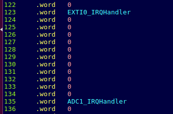
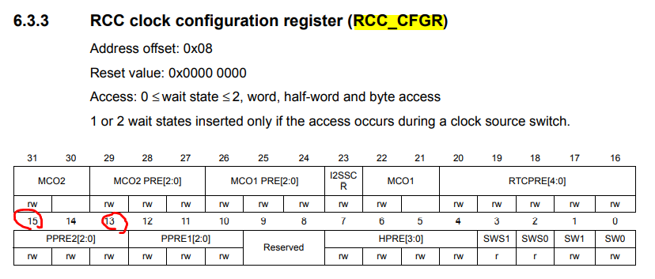

# 8강 ADC 구동 과정 정리 및 구현

#### 2016116563 윤성한

```
5/13일 수업에 대한 요약 정리입니다.

목표
1. ADC 구동 과정 요약 및 소스코드

-0513ADC로 소스코드 압축 

2.stdio.h 와 같은 standard library 를 사용하지 않고, ADC 변환 값을 UART 로 plotting 하는 프로그램 구현(STM32FDiscovery.h 헤더 파일만 참조.)
* 임베디드 시스템에서는 최대한 적은 메모리영역을 사용해야하기때문에 되도록이면 비교적 부피가 큰 표준 라이브러리 호출을 지양 해야합니다. 

-ADCMission로 소스코드 압축
```


# 1.  ADC 구동 과정 

* 사전 지식

``` 
ADC 란 anolog to digital converter의 약자로
아날로그 디지털 변환 회로 입니다. 즉 연속적인 아날로그 신호를 디지털 전기 신호로 변환 해주는 역할을 합니다.

ADC를 할때 다음 단계를 거쳐 변환을 하게되는데
1. Sampling 
Sampling은 연속적인 아날로그 신호를 일정한 시간 간격으로 측정하는 것을 말합니다. x축 ( =시간 t축)을 기준으로 하며 샘플링을 많이하면 데이터를 좀 더 자세하게 수집 할 수 있습니다. (정보의 대량화)
그림으로 표시하면 다음과 같습니다.
```


```
2. Quantization
Quantization는 한국어로 양자화라는 뜻이며 y축을 기준으로 정보를 구분합니다. 데이터의 크기(전압 등)을 좀더 세부적으로 구분할 수 있습니다. (정보의 구체화)
예를들어 아래의 그림은 3bit로 구분되는 AD Converter입니다.
```


* 개요

```
STM보드의 PA2, PA3을 USART모듈과 연결하고 ADC Interrupt를 활성화 시킨후 들어오는 값을 USART를 통해 gtkterm에 출력 및 아두이노 에뮬레이터를 통하여 확인합니다.
```

* 준비물

```
지난 시간과 마찬가지로 STM32보드를 사용합니다. 
추가로 UART 통신을 가능하게해주는 USB to UART ic인 FT232가 필요합니다. 

지난 시간과 마찬가지로 보드와 연결시에는
검은선 GND
빨간선 VDD
노란선 PA2
주황선 PA3
로 연결해주었습니다.
```

* 펌웨어 수정 전 준비사항

```
이번시간에는 ADC를 구동할 것이기때문에 저번시간에 사용하였던
헤더파일과 startup.s 파일에 ADC 레지스터와 인터럽트에 관한 내용을 반드시 추가해야만 이를 사용할 수 있습니다.
따라서 startup.s 파일과 헤더파일 수정을 하였습니다.
```

* 헤더파일 수정

```
STM32FDiscovery.h 파일을 열어 다음과 같은 구조체를 선언해줍니다.
각각은 ADC를 구동하기위해 사용되는 레지스터입니다.
```


```
또한 ADC에 사용할 Boundary address 와 포인터에 매크로를 지정해줍니다.
```


```
직접 Reference manual을찾아본 결과, 값이 일치함을 확인하였습니다.
```


* startup.s 파일 수정

```
벡터테이블 상에서 위의 사진과 같은 곳에 ADC가 지정되있으므로 
main함수 내부에서 ADC를 interrupt처리하기 위해 IRQ_Handler을 선언 해주어야합니다.
startup.s파일 상에서는 135번 째 라인에 위치합니다.
다음 그림과 같이 추가해줍니다.
```



```
위의 준비과정이 모두 끝났다면 이제부터 main.c에 사용할 기능들을 코딩할 것 입니다.
```


* main.c 코딩

```
우선 시작 전 새로 사용할 변수들을 선언해줍니다.
또한 이후에 sprintf함수를 사용하기위해 stdio.h 헤더파일을 포함해줍니다.
```


````
지난시간에 usart2 통신을 위해 사용하였던 코드에서 ADC를 이용하여 gtkterm으로 값을 출력할 것이기때문에 ADC를 SETTING해주어야합니다. 
````


```
위의 Bit masking의 설명 중 이해가 되지 않는 부분들을 referen manual을 통해 찾아보았습니다.

GPIOA_MODER |= 3<<2;
Port a1을 analog mode로 작동시켜 이후에 PA1 를 건드리면 출력값이 바뀌는것을 알 수 있습니다.

RCC_CFGR |= 1<<15 | 1<<13; 
```




```
찾아보니 APB2 Clock을 끌어온것을 적절한 속도로 사용하기위해 분주시키는 부분이었습니다! 

다른 부분들은 reference manual에 나와있는 설명과 주석 처리된 부분이 같아서 이해할 수 있었습니다.

8비트 양자화를 하기위해 resolution을 8bit로 설정하고 1 대 1로 변환 하는 내용등 ADC 설정 Bit masking관련이었습니다.
```


* Interrupt handler 설계


```
다음은 interrupt service routine을 통해 ADC1 Interrupt가 발생 시 어떤 행동을 취할것인지를 작성합니다.

ADC1_SR 즉 Status register의 1번째 비트값의 상태를 점검하여 읽어 들일지 아닐지를 판단합니다 아래그림을 보면 1번째 비트는 EOC로 변환이 완료 됨을 확인해주는 역할을 합니다. 따라서 conversion이 끝나면 if문 안의 함수들을 실행합니다.
```


```
if문 내부 코드입니다.

	adc_val = ADC1_DR & 0xFF;
아스키코드는 8비트기 때문에 data register의 뒤에서 8비트만 읽어들여 adc_val에 넣어줍니다.

	len = sprintf(buf, "%3d\n", adc_val);
adc_val에 받은 char을 buf에 %3d\n 형식으로 입력하고 그 길이를 len에 반환 해주고있습니다. sprintf는 stdio.h 헤더파일에서 가져옵니다.

	sendStr(buf, len);     
문자열 buf와 char len를 함수에 넣습니다. 이후에 설명합니다

그리고 인터럽트를 재사용하기 위해 초기화 시켜줍니다.
ADC1_CR2    |= 1<<30; //interrupt reset
```


```
위의 함수는 문자열과 문자열 길이를 입력받아 USART2_DR에 넣습니다, 즉 gtkterm화면에 buf의 값을 출력하는 함수입니다.
```


```
마지막으로 main에 set_ad1()함수를 입력하여 Setting 해줍니다.(register bit masking)

또한 만약을 대비해 interrupt초기화를  함수 끝에 작성해줍니다.

make를 하기전 makefile에 stdio.h를 사용하기위해 선언을 해줍니다.
```


```
모든과정이 끝나면 make flash를하여 보드에 업데이트 해줍니다.
```


* 최종 출력


```
위 그림처럼 입력 해줍니다. 115200는 baudrate로 전송 속도와 관계있습니다.
```


```
터미널을 실행하면 지속적으로 아날로그 신호가 디지털 신호로 변환되어 출력됩니다. 이번에는 이를 아두이노를 통하여 시각적으로 보겠습니다.
```


```
아두이노 IDE를 실행합니다.
```


```
port설정을 해준 뒤 위의 Serial plotter을 눌러줍니다.
```


```
위 그림과 같이 지속적으로 값을 출력 하고있습니다.
```


```
손으로 PA1 을 건드릴경우 우리몸은 전류가 흐르고 있기때문에 값이 변함을 확인할 수 있었습니다.
```

* 이상으로 ADC 구동과정 요약을 마칩니다.

---

---

# 2. stdio.h 를 사용하지 않고 ADC변환 값을 UART로 plotting 하는 프로그램 구현

* 요구사항

```
stdio.h 와 같은 standard library 를 사용하지 않고, ADC 변환 값을 UART 로 plotting 하는 프로그램 구현 - main.c 파일 외에 다른 파일 수정 금지

즉 sprintf를 사용하지않고 내부구현한 후 결과가 일치하면 성공입니다.

위의 main.c 코드에서 sprintf가 사용된 부분을 보면
```


```
총 3가지 변수가 영향받습니다.

1. 입력값 = adc_val, unsigned char 즉 1바이트 문자로 값이 담깁니다.
여기서 adc_val은 0xFF 즉 하위 8비트만 사용되고 나머지는 0으로 채워져있습니다.(ASCII 코드는 8비트로 이루어져있으므로 그 이상 필요없음)

2. 출력값 으로는 문자열 buf와 문자열의 총 길이 len를 반환하여 
최종적으로 sendStr함수에서 사용 될 값을 제공 해주는 역할을 하고있습니다.

반환값 len은 3자리수 확보 후 개행문자를 리턴하므로 무조건 4입니다.
혹시나 해서 아래코드로 확인해보았으나 이상 없었습니다.
```

###  소스코드


```
따라서 내부구현으로는 8비트로 이루어진 adc_val값을 문자열 화(=ASCII화)하여 buf에 넣으면 될 것입니다.

현재 adc_val는 1바이트의 0~255 값을 가진 상태입니다.
따라서 100의자리 10의자리 1의자리를 구하여 이값을 ASCII화 한뒤 buf에 
차곡차곡 넣어버리면 됩니다.
```


### 소스코드 

```
우선 sprintf 라인을 지우고 새롭게 conv라는 함수를 선언해줍니다.

이 함수는 커스텀 함수로 이 과제에 맞춤형 으로 제작하였습니다.

아까 서술했듯이 sprintf에서 %3d\n, 즉 문자열 길이 반환 값은 개행 포함 4로 고정이기때문에 고정시켰습니다. (len = 4)

conv는 문자열 adc_val 값으로부터 buf에 값을 반환 하여줍니다.
```


* 함수 conv 설명 


```
우선 type casting을 하여 문자상태의 adc_val을 1~3자리수의 int a로 변환합니다. 여기서 3자리 수라고 언급한 이유는 8 bit resolution이기 때문에 0 ~ 255 값만을 가집니다.

이후 number[0],[1],[2]에는 각각 100의자리 10의자리 1의 자리의 숫자를 넣어줍니다.

각각의 값에 48을 더하고 char로 type casting해줍니다.
그렇게 하면 각 자리는 ASCII코드 0 ~ 9 의 문자열로 반환 됩니다.
(아래 그림처럼 10진수 48은 ASCII코드 0의 문자)
```


```
만약 윗자리 수 값이 0일경우 buf에 공백을 넣어주어 sprintf함수 쓰기전과 완벽히 똑같이 구현하였습니다.

마지막 버퍼에는 개행을 넣어주며 종료됩니다.
```

* 실행


```
stdio.h 없이도 같은 동작을 수행합니다.
```


```
손으로 건드릴경우 바뀌는 숫자 값의 출력 형도 바뀌지않았습니다.
```

* 아두이노 환경에서의 동작도 이상이 없었습니다.


```
따라서 sprintf를 사용하지 않고 내부구현한 후 결과가 완벽히 일치하는것을 확인하였습니다.
```

* 이상으로 헤더파일 미포함 ADC 구동 설명을 마치겠습니다.

---

---

reference : STM32F Reference Manual, STM User Guide

https://blog.naver.com/PostView.nhn?blogId=hjyang0&logNo=183751139&parentCategoryNo=&categoryNo=&viewDate=&isShowPopularPosts=false&from=postView

https://modoocode.com/66
