# Term Project

#### 2016116563 윤성한

* 스펙트럼 분석기

```
공통 프로젝트 과제

1. 보드에서 아날로그 데이터를 입력받습니다.
2. 입력되는 데이터에 FFT 계산을 수행하여 주파수 대역별 스펙트럼 성분을 확인합니다.
3. 스펙트럼 계산 결과를 UART 통신으로 PC에 전송합니다.
4. PC에서는 전송받은 UART 데이터를 바탕으로 스펙트럼 성분들을 그래프로 시각화합니다.
5. 위 과정을 반복합니다.
```


# 1. Spectrum Analyzer

* 개요

```
STM보드의 PA2, PA3을 USART모듈과 연결하고 ADC Interrupt를 활성화 시킨후 들어오는 값에 FFT 계산을 내부수행 

1 ~ 32 Hz의 각각의 주파수 성분을 USART를 통해 PC로 송신한 후 Processing을 사용하여 1 ~ 32 Hz 의 주파수 성분을 각각 출력.
```

* 준비물

```
지난 시간과 마찬가지로 STM32보드를 사용합니다. 
추가로 UART 통신을 가능하게해주는 USB to UART ic인 FT232가 필요합니다. 
```

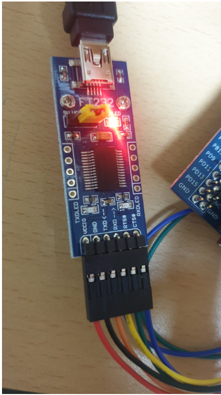

```
지난 시간과 마찬가지로 보드와 연결시에는
검은선 GND
빨간선 VDD
노란선 PA2
주황선 PA3
로 연결해주었습니다.
```

* plotting을 위한  언어 "Processing"

```
termproject에서 gnuplot 말고도 시각적으로 주파수 성분을 plot할수있는 언어 processing을 사용하였습니다. 
```

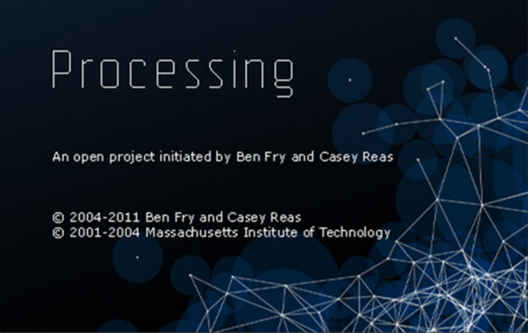


* 프로젝트 시작 전 염두해두어야할 사항

```
1. ADC resoltion은 8bit 이므로 범위는 0 ~ 255 이다.

2. 숫자를 보내나 문자를 보내나 프로세싱은 문자로 해석한다.
ex) 숫자 123을 보내면 프로세싱은 이를 '1', '2', '3' 으로 즉, 아스키 코드값인 49, 50, 51로 데이터를 받고 출력한다.

3. 아두이노와 프로세싱이 연동되는 속도가 50 이고 STM보드의 경우 이것보다 더 빠르므로 FFT 연산 이후 USART로 송신 시 프로세싱이 처리할수 있도록 적절한 속도로 보내야 한다.

4. FFT는 주기적 신호에만 적합하다.
```

* 사용한 main 코드 분석

```
중점적으로 봐야할 부분은 FFT 연산 부분과 USART로 내보내는 부분입니다.
```

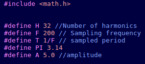

```
우선 sin 함수를 사용하기 위해 math.h를 추가하고
FFT에 사용할 값들을 매크로 지정해줍니다. 
1 ~ 32Hz를 분석할 것입니다.
```

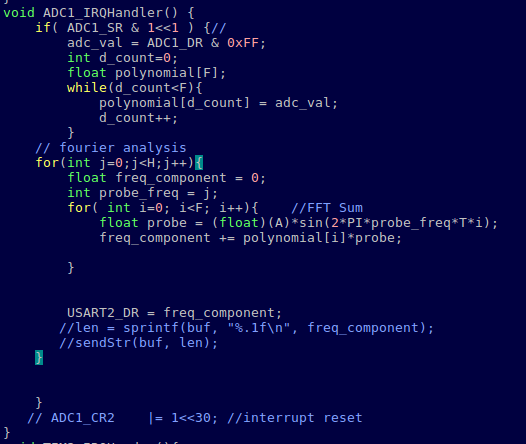

```
ADC 인터럽트에서 들어오는 신호 하나를 polynomial에 하나의 신호로써 담습니다. 그리고 담긴 신호의 값을 FFT연산을 한뒤 USART를 사용하여 PC로 전송합니다.
계산된 Strength값을 DR을 통해 PC로 전달합니다.
```

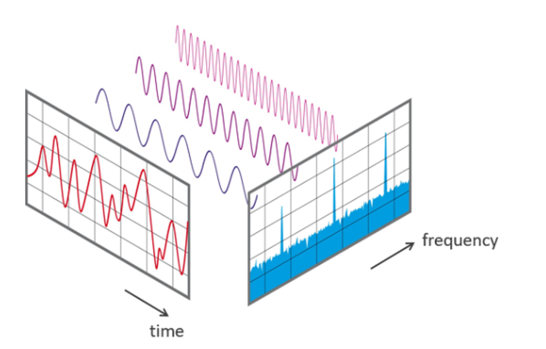

```
하나의 입력신호를 FFT를 통하여 주파수영력으로 plot할 것입니다.
관찰할 신호 주파수에 해당하는 다항식값을 곱해서 freq_componet에 더해줍니다 freq_component는 uart를 통해 pc로 전달됩니다. 
```

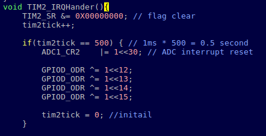

```
0.5초마다 ADC 인터럽트를 리셋 시켜줍니다. 
즉 0.5초마다 새로운 adc신호를 측정합니다.
너무 빨리 ADC값을 받을 경우 UART로 보내는값과 프로세싱이 연동되는 속도가 맞지 않아서 버퍼링이 걸릴수 있으므로 0.5초로 설정하였습니다.
```


* processing  소스코드

```
이제 STM32보드로 부터 받은 USART데이터를 시각화 하여야합니다.
1 ~ 32Hz의 분석된 값을 "한 세트로" 화면에 출력 하여야하므로 loop에 출력값을 잘 맞춰 조절합니다.
```

* 전체 코드

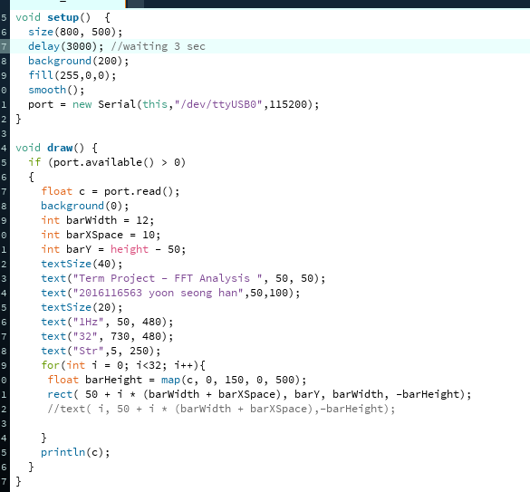

``` 
processing에서 크게 2파트로 나뉩니다.

처음 초기에 실행할 setup부분과 계속 반복하게 될 draw 부분입니다.

다음의 경우 setup입니다.
```

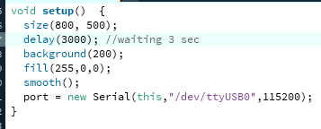

```
size(800, 500)을 통해 띄울 창 크기를 적절하게 설정해주고
delay(3000) -> 안정성을 위해 3초간 대기합니다. 
바로 데이터를 전송할 경우 데이터가 날뛰는 현상이 종종 발생하였고 
딜레이를 주어 이를 방지하였습니다.
fill(255,0,0)
그래프 바는 RGB에서 빨간색에 255로 최대값을 주었습니다.

smooth()를 사용하여 픽셀이 안깨지도록 설정해주고 

마지막으로 연결된 포트와 baudrate를 입력해줍니다.

이로써 setup작업이 끝났습니다.
```


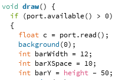

```
USART로부터 입력받은 데이터값을 이제부터 반복해서 출력할 것입니다.
실수형 c에 데이터를 저장합니다. 데이터는 각 주파수의 strength값입니다.
```


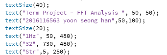

```
출력하고싶은 문구를 text함수를 통해 작성합니다.
```


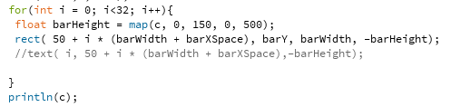

```
map 함수를 사용하여 그래프 바의 크기를 화면에 적절하게 세팅해줍니다.

이후 직사각형의 막대 그래프 바를 출력하여 줍니다.
```


* 결과

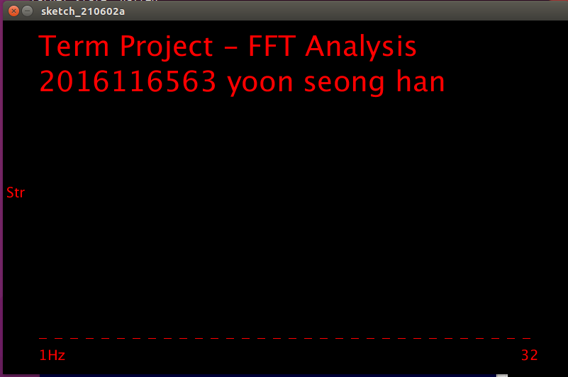

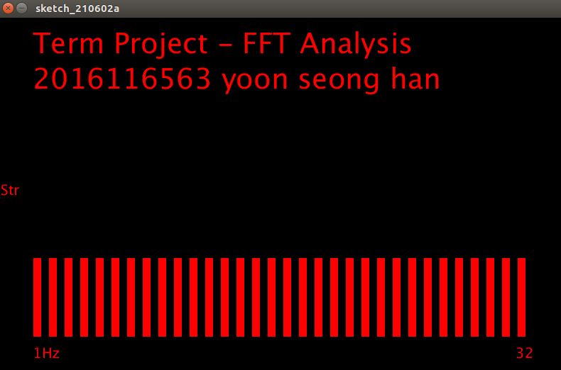

```
adc에서 들어오는 입력값에 따라 1 Hz부터 32Hz까지의 성분이 그래프로 출력 되는것을 확인할 수 있었습니다.
0.5초 간격으로  화면이 초기화됩니다.
원래 의도는 32개의 그래프에 각각의 성분을 plot해야하나
1hz부터 32hz까지의 값을 0.5초안에 화면에 뿌리는 식으로 변경
```


---

---

# 2. 추가 개별프로젝트

* 소음방지 빛감지 LED

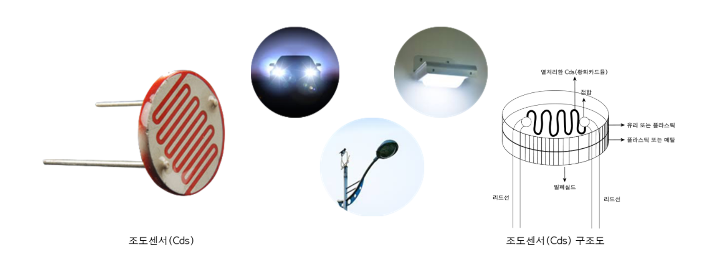

```
조도 센서를 사용하여 어느정도 이하의 밝기가 될 경우 자동으로 LED를 켜주는 초소형 가로등 LED를 제작 할 예정입니다.

1. 
조도 센서를 ADC에 연결 후 받은 값을 통하여 일정 밝기 이하일 시 LED를 켜주고 USART를 통하여 PC화면에 초소형 가로등이 켜졌음을 알리는 문구를 processing을 통해 출력 
버튼입력을 통하여 LED가 켜지는 밝기의 정도를 조절 할 수 있게 할 것입니다.

2.
1번이 성공할 경우, 소리 감지도 추가하여 어느정도 이상일 경우(방해될 정도의 소리크기) 경고를 주도록 설계 할 예정
```


---

---

reference : STM32F Reference Manual, STM User Guide

https://blog.naver.com/PostView.nhn?blogId=roboholic84&logNo=221235680319

http://interactivedesign21.blogspot.com/2017/12/blog-post_10.html

https://kocoafab.cc/tutorial/view/90

https://processing.org/reference/map_.html

https://venusyu.tistory.com/18

https://ko.wikipedia.org/wiki/ASCII

https://designatedroom87.tistory.com/306?category=902512
